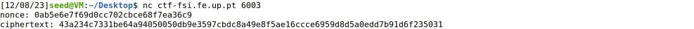
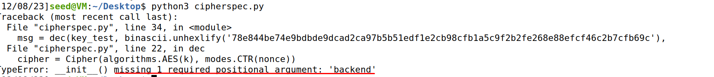
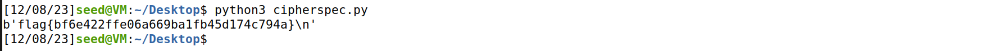

# CTF Semana #10 (Weak Encryption)

For this ctf, we first start by looking into the provided file:

```
from cryptography.hazmat.primitives.ciphers import Cipher, algorithms, modes
import os

KEYLEN = 16

def gen(): 
	offset = 3 # Hotfix to make Crypto blazing fast!!
	key = bytearray(b'\x00'*(KEYLEN-offset)) 
	key.extend(os.urandom(offset))
	return bytes(key)

def enc(k, m, nonce):
	cipher = Cipher(algorithms.AES(k), modes.CTR(nonce))
	encryptor = cipher.encryptor()
	cph = b""
	cph += encryptor.update(m)
	cph += encryptor.finalize()
	return cph

def dec(k, c, nonce):
	cipher = Cipher(algorithms.AES(k), modes.CTR(nonce))
	decryptor = cipher.decryptor()
	msg = b""
	msg += decryptor.update(c)
	msg += decryptor.finalize()
	return msg
```

We can easily see that in the 'gen()' algorithm, only the three final bytes are generated randomly.

This is very important since it can be vulnerable to brute force attacks. If we try to change only the last 3 bytes in each try, we can obtain the ctf flag.

For this, we will connect to the server, where we can get the nonce and cyphertext:

```
nonce: 0ab5e6e7f69d0cc702cbce68f7ea36c9
ciphertext: 43a234c7331be64a94050050db9e3597cbdc8a49e8f5ae16ccce6959d8d5a0edd7b91d6f235031
```


Now, we will perform a brute force attack, where we will only change the last 3 bytes and after we decipher the message, we will check if the first 4 bytes are equal to "flag" since the flags in ctfs start like this. If so, we print it.

For that, we created a for cycle where we will test every possible values of the last 3 bytes. Since each byte has 8 bits, we will have 2 ^24 possible combinations, which is still a lot.

Firstly, we developed the following script:
```
from cryptography.hazmat.primitives.ciphers import Cipher, algorithms, modes
import os
import binascii

KEYLEN = 16

def gen(): 
    offset = 3 # Hotfix to make Crypto blazing fast!!
    key = bytearray(b'\x00'(KEYLEN-offset)) 
    key.extend(os.urandom(offset))
    return bytes(key)

def enc(k, m, nonce):
    cipher = Cipher(algorithms.AES(k), modes.CTR(nonce))
    encryptor = cipher.encryptor()
    cph = b""
    cph += encryptor.update(m)
    cph += encryptor.finalize()
    return cph

def dec(k, c, nonce):
    cipher = Cipher(algorithms.AES(k), modes.CTR(nonce))
    decryptor = cipher.decryptor()
    msg = b""
    msg += decryptor.update(c)
    msg += decryptor.finalize()
    return msg

target = b"flag"
for i in range(0, pow(2, 24) -1, 1):
    key = bytearray(b'\x00'(KEYLEN-3))
    key.extend(bytes(i.to_bytes(3, 'little')))
    key_test = key
    msg = dec(key_test, binascii.unhexlify('43a234c7331be64a94050050db9e3597cbdc8a49e8f5ae16ccce6959d8d5a0edd7b91d6f235031'),
    binascii.unhexlify('0ab5e6e7f69d0cc702cbce68f7ea36c9'))

    if(msg[:4] == target):
        print(msg)
```

However, when we tried to run the script, we got the following error:



To fix this, we just imported default_backend using:
```
from cryptography.hazmat.backends import default_backend
```
and then updated the dec function:
```
def dec(k, c, nonce):
    cipher = Cipher(algorithms.AES(k), modes.CTR(nonce), backend = default_backend())
    decryptor = cipher.decryptor()
    msg = b""
    msg += decryptor.update(c)
    msg += decryptor.finalize()
    return msg
```

Now, when we run the script, we can see the flag, whihc means that our attack was successful


Finally, we got the flag:

