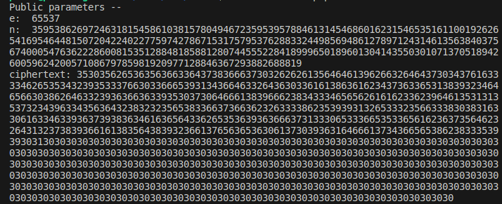
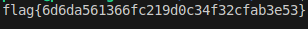

# CTF Week #11 (RSA)


This week, we explored the cipher mechanism based in RSA in association with factorization. We are given a **ciphertext** (our target), the associated module **n**, and the public exponent **e**.



## Clues
We are told the module is generated through 2 prime numbers:
- p, close to 2^512
- q, close to 2^512
To find the module we first need to get these 2 numbers that multiply to get the so desired **n**. We just need a function to determine if a number is prime and use this code:

```python
    def getNextPrime(number):
        interval = 10000
        for i in range(number - interval, number + interval):
            if is_prime(i) and n % i == 0:
                return i
    p = getNextPrime(2**512)
    q = getNextPrime(2**513)
``` 
The interval is used because we need to check both numbers below and above the target.
After confirming that the p and q are right (if p * q = n) we need to use these numbers, in addition to the **e** exponent, to calculate the **d** variable that we will use to decode our ciphertext.
This code will give us just that: 
```python
def rsa(p, q, e):
    phi = (p - 1) * (q - 1)
    d = pow(e, -1, phi)
    return d

d = rsa(p, q, e)
```

Now that we have the **d** variable, we use the function given to us in the "challenge.py" file:

```python
def dec(y, d, n):
    int_y = int.from_bytes(unhexlify(y), "little")
    x = pow(int_y,d,n)
    return x.to_bytes(256, "little")

aux = unhexlify(ciphertext)

result = dec(aux, d, n)

```
We now just need to print the result, our flag, decoding the result: 
```python
print(result.decode("ascii"))
```
Here it is: 

