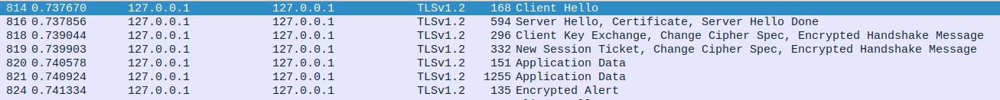
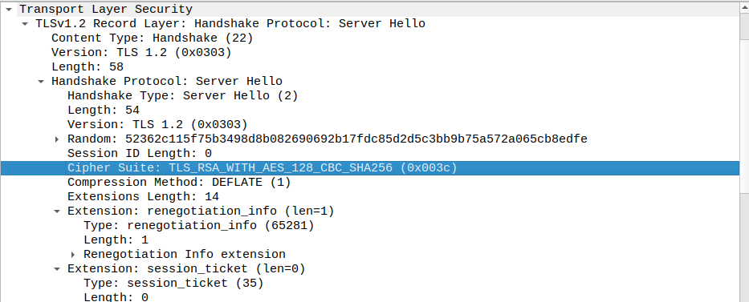
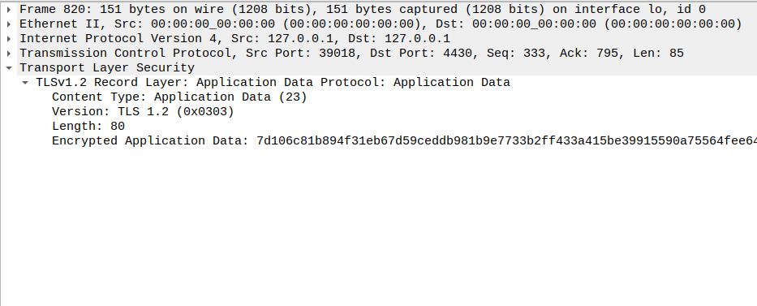
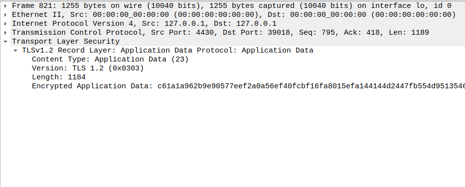
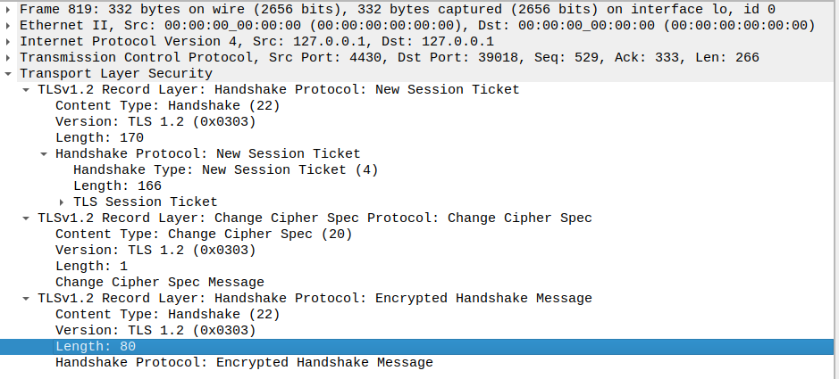

# Find-My-TLS

## Introduction
This weeks challenge is about finding the flag in a TLS connection. We are given a pcap file with a TLS connection and we need to find the flag.

## Clues
The flag has the following format: flag{frame_start-frame_end-selected_cipher_suite-total_encrypted_appdata_exchanged-size_of_encrypted_message} 

We are also told that the handshake with random number for the Client Hello : 52362c11ff0ea3a000e1b48dc2d99e04c6d06ea1a061d5b8ddbf87b001745a27

## Solution
By knowing the handshake random number we can search for it in the pcap file. We find the frame number 814. We can then observe that the frames we are interested in are from 814 to 824. Lets then start extracting the information that we need for the flag.

The handshake goes from frame 814 to 819 as we can see in the following image, the app data starts in frame 820:
 

In the server hello, we can see the cyper that it chose to use, in this case it was TLS_RSA_WITH_AES_128_CBC_SHA256.

For the total encrypted app data exchanged, we just add the length of the app data in frames 820 and 821, which is 1184 + 80 = 1264.

Finally, we need to find the size of the encrypted message on the frame that concludes the handshake. We can do this by looking at the size of the app data in frame 819, which is 80.

We can now build the final flag: flag{814824TLS_RSA_WITH_AES_128_CBC_SHA256126480}
