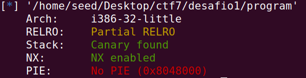
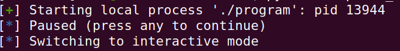
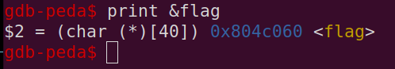
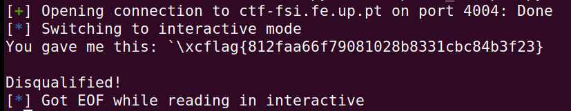
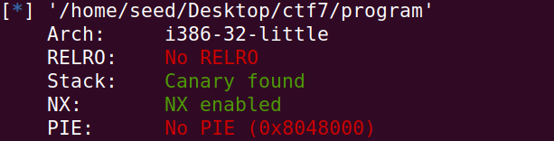

# Format String 

## Desafio 1 - Pistas
É nos fornecido um ficheiro zip, com um executável e um código fonte. Ambos servem para tentar obter a 'dummy flag' localmente para depois usar o exploit na port 4004 do servidor ctf-fsi.fe.up.pt. Para testar o exploit localmente, basta correr o script 'exploit_example.py'.
O código fonte é o seguinte:

Ao corrermos checksec no executável, obtemos o seguinte:



A stack encontra-se protegida, o que significa que não podemos fazer buffer overflows. Existem proteções do endereço de retorno usando canários, porém o binário não é randomizado.

Analisando o código fonte, podemos ver que o programa usa 'scanf' para ler o input do utilizador, o que significa que podemos fazer um format string attack.

```c
scanf("%32s", &buffer);
```

Uma vez que a flag se encontra numa variável global e através do checksec percebemos que os endereços do programa são estáticos, podemos usar o gdb para obter o endereço da flag.

Ao corrermos o script 'exploit_example.py' localmente, obtemos o o pid do processo que está a correr o programa.:



Isto vai-nos permitir dar attach ao processo com o gdb:

```bash
$ gdb attach pid 13944
```

Ao corrermos o programa no gdb, podemos ver que o endereço da flag é 0x0804c060:



## Desafio 1 - Solução

Para obter a flag, basta fazer um format string attack, escrevendo o endereço da flag no buffer. Para isso, basta correr o script 'exploit_example.py' localmente.

```python
p.recvuntil(b"got:")
p.sendline(b"\x60\xc0\x04\x08%s")
p.interactive()
```
Este input é apenas o adress da flag em little endian, seguido de %s para que o printf imprima o que está no endereço da flag.

Ao corrermos no servidor ctf-fsi.fe.up.pt, obtemos a flag:



## Desafio 2 - Pistas

É nos fornecido outro ficheiro zip com um executável, e o seu código fonte. A flag encontra-se novamente no ficheiro 'flag.txt'

Ao corrermos o checksec obtemos este output:



O programa continua sem randomização de endereços. Desta vez o código fonte lança a bash se a variável 'key' for 0xBEEF, ou 48879 em decimal. Com esta backdoor podemos ter acesso total ao servidor e desta maneira conseguir o conteúdo da flag.

Como a variável 'key' é global, temos que ter acesso ao seu address. Para isso recorremos novamente ao gdb:


