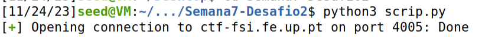

# Format String 

## Desafio 1 - Pistas
É nos fornecido um ficheiro zip, com um executável e um código fonte. Ambos servem para tentar obter a 'dummy flag' localmente para depois usar o exploit na port 4004 do servidor ctf-fsi.fe.up.pt. Para testar o exploit localmente, basta correr o script 'exploit_example.py'.
O código fonte é o seguinte:

Ao corrermos checksec no executável, obtemos o seguinte:


É possível observar que o programa tem Partial RELRO, pelo que não existe risco de buffer overflow. Existem proteções do endereço de retorno usando canários, porém o binário não é randomizado. Um ataque com uso de buffer overflow será detetado antes de executar o código malacioso. Como o NX está ativado, os atacantes são impedidos de saltar para shellcode personalizado que eles armazenaram na stack ou em uma variável global. Não há PIE, então os ataques ROP não são dificultados.

Analisando o código fonte, podemos ver que o programa usa 'scanf' para ler o input do utilizador, o que significa que podemos fazer um format string attack.

```c
scanf("%32s", &buffer);
```

Na linha 28, o programa dá print ao input do utilizador, e o utilizador tem controlo sobre o primeiro argumento do printf, o que pode levar a vulnerabilidades de "memory leaks", como a leitura ou alteração do valor de variáveis.

Uma vez que a flag se encontra numa variável global e através do checksec percebemos que os endereços do programa são estáticos, podemos usar o gdb para obter o endereço da flag.

Ao corrermos o script 'exploit_example.py' localmente, obtemos o o pid do processo que está a correr o programa.:


Isto vai-nos permitir dar attach ao processo com o gdb:

```bash
$ gdb attach pid 13944
```

Ao corrermos o programa no gdb, podemos ver que o endereço da flag é 0x0804c060:


## Desafio 1 - Solução

Para obter a flag, basta fazer um format string attack, escrevendo o endereço da flag no buffer. Para isso, basta correr o script 'exploit_example.py' localmente.

```python
p.recvuntil(b"got:")
p.sendline(b"\x60\xc0\x04\x08%s")
p.interactive()
```
Este input é apenas o adress da flag em little endian, seguido de %s para que o printf imprima o que está no endereço da flag.

Ao corrermos no servidor ctf-fsi.fe.up.pt, obtemos a flag:


## Desafio 2 - Pistas

É nos fornecido outro ficheiro zip com um executável, e o seu código fonte. A flag encontra-se novamente no ficheiro 'flag.txt'

Ao corrermos o checksec obtemos este output:


À semelhança do primeiro desafio, o programa continua sem randomização de endereços e, por isso, já sabemos com o que estamos a lidar. Novamente: É possível observar que o programa tem No RELRO, pelo que não existe risco de buffer overflow. Existem proteções do endereço de retorno usando canários, porém o binário não é randomizado. Um ataque com uso de buffer overflow será detetado antes de executar o código malacioso. Como o NX está ativado, os atacantes são impedidos de saltar para shellcode personalizado que eles armazenaram na stack ou em uma variável global. Não há PIE, então os ataques ROP não são dificultados. 

Desta vez o código fonte lança a bash se a variável 'key' for 0xBEEF, ou 48879 em decimal (linha 18). Com esta backdoor podemos ter acesso total ao servidor e desta maneira conseguir o conteúdo da flag.

## Desafio 2 - Solução

Como a variável 'key' é global, e por isso está alocada na Heap, temos que ter acesso ao seu address e mudar o valor, pelo que iremos recorrer a um ataque de format string usando "%n". Para isso recorremos novamente ao gdb:


Para descobrirmos a flag, vamos novamente usar um ataque de format string, no entanto, com algumas mudanças.

Precisamos, então, de escrever um valor para dar match a "0xbeef" para abrir uma bash que vamos usar para obter o valor da flag, usando "cat flag.txt". Como sabemos que 0xbeef representa 48879 em decimal, este é o valor que a "key" deve ter.

Para isso, escrevemos primeiro os 4 bytes para o endereço da variável. Os restantes 48875 bytes vão ser preenchidos com o formato %x com largura fixa. Com %[largura]x == %48875x, o programa irá ler 48875  bytes e irá tentar imprimi-los.

Por último, o especificador %n impedirá a impressão desses bytes, mas ainda os contará, de modo que o valor armazenado no endereço será o valor que desejamos.

Esta explicação é refletida no seguinte código:

```
from pwn import *

p = remote("ctf-fsi.fe.up.pt", 4005)

p.recvuntil(b"here...")
p.sendline(b"\x24\xb3\x04\x08%48875x%1$n")
p.interactive()
```

Para isso, criamos um scrip auxiliar como conteúdo anterior e após a sua execução tivemos o seguinte output:




Ao executar conseguimos ter acesso ao conteúdo do ficheiro flag.txt e à flag do desafio, "flag{83b68c908c4bbdd8ec36f1f4802e73f2}"


