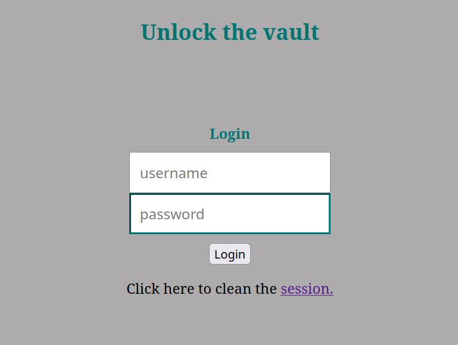
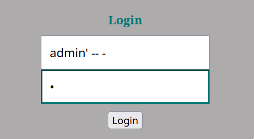
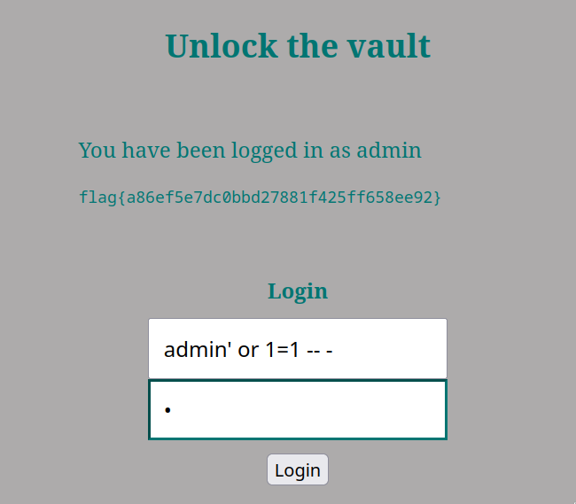

# CTF Week #8 (SQL Injection)
## Introduction
For this CTF we were only given an index.php file which is the code that runs on the server that is located at http://ctf-fsi.fe.up.pt:5003/. We were also told that the flag is in a file called flag.txt whose contents are shown to those who authenticate on the server.

In the server we can find the following login page:



## Clues
 From the code we can see that the preparation of the query to the database is not safe since no escapes are made to the user's input strings. This facilitates the whole SQL Injection process.

## Solution
The first intuition we had was to try to login with the username admin. However, as we do not know its password, we must try to comment out the rest of the query so that we only need to provide the username of the user we want to access. We therefore insert the following:

```



The username we write makes the query to be the following:

``

```sql
SELECT * FROM users WHERE username = 'admin' -- - ' AND password = '.'
``````


Basically we enter the name of the administrator and close the apostrophe that contains the username string. With this, the rest of the input will be interpreted as SQL code. By inserting two dashes (--) after closing the apostrophe we will be commenting out the entire query that would be done next, which in this case is the password verification. This way we can easily log in without knowing the administrator's password. We can thus get the flag:




