# Public Key Infrastructures

## Overview
Public key cryptography is the foundation of today’s secure communication, but it is subject to man-in-themiddle attacks when one side of communication sends its public key to the other side. The fundamental problem is that there is no easy way to verify the ownership of a public key, i.e., given a public key and its claimed owner information, how do we ensure that the public key is indeed owned by the claimed owner?
The Public Key Infrastructure (PKI) is a practical solution to this problem.

## 3.1 Task 1: Becoming a Certificate Authority (CA)

### Context
A Certificate Authority (CA) is a trusted entity that issues digital certificates. The digital certificate certifies the ownership of a public key by the named subject of the certificate.
In this lab, we need to create digital certificates, but we are not going to pay any commercial CA. We will become a root CA ourselves, and then use this CA to issue certificate for others (e.g. servers). In this task, we will make ourselves a root CA, and generate a certificate for this CA. Unlike other certificates, which are usually signed by another CA, the root CA’s certificates are self-signed. Root CA’s certificates are usually pre-loaded into most operating systems, web browsers, and other software that rely on PKI. Root CA’s certificates are unconditionally trusted.

### Solutions

In this task we firstly need to copy openssl.cnf into our PKI folder so we can have the configuration file to create certificates. After this, under [CA Default] section the following content needs to be present:

```
[ CA_default ]
dir = ./demoCA 
certs = $dir/certs 
crl_dir = $dir/crl 
database = $dir/index.txt 
unique_subject = no  #uncommented
new_certs_dir = $dir/newcerts
serial = $dir/serial 
```

To add the necessary files and folders, we created an auxiliar scrip "task1.sh" with the following content:

```
#!/bin/bash

mkdir demoCA
cd demoCA
mkdir certs crl newcerts
touch index.txt
echo "1000" > serial
```

After the initial setup, we need to generate a self-signed certificate for our CA. By executing ``` openssl req -x509 -newkey rsa:4096 -sha256 -days 3650 \-keyout ca.key -out ca.crt``` we got the following output:

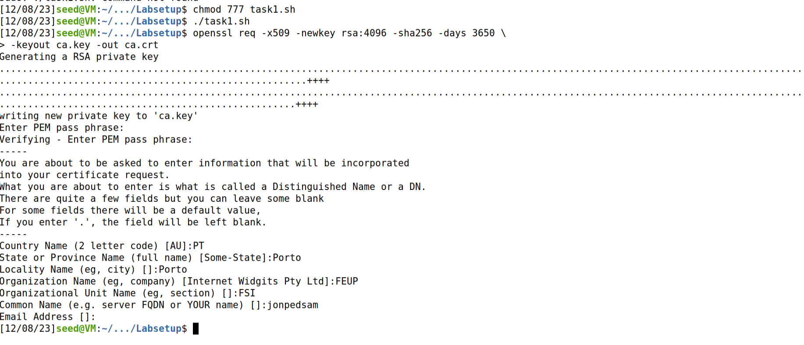

We can use the following commands to look at the decoded content of the X509 certificate and the RSA key:

Output of ```openssl x509 -in ca.crt -text -noout```:

```
Certificate:
    Data:
        Version: 3 (0x2)
        Serial Number:
            7b:0c:19:95:61:b7:ee:b8:b7:30:7a:3f:fe:d3:a0:9c:54:a7:bd:bc
        Signature Algorithm: sha256WithRSAEncryption
        Issuer: C = PT, ST = Porto, L = Porto, O = FEUP, OU = FSI, CN = jonpedsam
        Validity
            Not Before: Dec  8 12:40:40 2023 GMT
            Not After : Dec  5 12:40:40 2033 GMT
        Subject: C = PT, ST = Porto, L = Porto, O = FEUP, OU = FSI, CN = jonpedsam
        Subject Public Key Info:
            Public Key Algorithm: rsaEncryption
                RSA Public-Key: (4096 bit)
                Modulus:
                    00:c6:b4:d1:fd:e7:a0:6e:c9:b7:13:bd:08:31:62:
                    43:32:10:cb:36:15:a5:f4:07:93:3b:fc:19:68:77:
                    bc:84:66:3e:bf:69:46:e8:b0:94:60:66:cb:db:30:
                    b0:5d:56:23:eb:a8:15:8e:a3:5c:a3:88:ee:75:31:
                    ba:46:be:9f:12:e5:f6:3d:de:49:77:e3:50:9b:89:
                    3d:e4:1c:f4:1d:f6:9d:40:41:c4:3c:6d:15:3c:93:
                    34:83:6d:b2:8d:50:1d:f2:35:1e:e2:0e:20:de:69:
                    de:ec:46:4c:3d:c3:f6:54:cd:2e:19:e7:ce:74:1a:
                    b5:d7:70:45:d2:58:99:2f:e7:77:a1:87:66:2f:ba:
                    f8:eb:6f:7d:ea:68:3f:43:07:ba:9f:c4:bb:3b:39:
                    d7:1a:5e:2b:21:6b:11:81:db:cf:ec:75:f5:11:8b:
                    61:fb:49:60:e4:7b:1f:00:c8:1b:e2:a5:5e:c2:93:
                    43:19:f3:5d:d5:a0:6b:6f:4e:c2:82:96:63:24:7f:
                    cb:e8:64:6e:f2:26:92:1e:43:b2:96:2b:34:1f:b6:
                    94:8a:9b:c9:8a:a0:91:58:8c:5f:ab:ab:c2:e9:c1:
                    1a:18:d7:3b:08:65:de:89:89:d9:93:37:01:7d:82:
                    ca:b8:cf:e5:53:a8:5a:73:43:28:4c:25:0a:ff:ed:
                    56:fe:79:48:3e:fd:41:37:02:18:05:54:bf:6c:fc:
                    2c:86:ed:8b:83:73:de:61:71:f3:fc:62:d6:c0:e6:
                    17:c1:24:39:12:2c:44:e7:a7:a8:18:6b:f1:8e:03:
                    a3:54:4c:26:3b:21:c6:b7:a8:c6:7d:bc:9f:cd:1b:
                    0e:14:2c:aa:9d:6d:d9:b5:80:53:62:70:41:9a:d6:
                    05:f3:0f:c0:18:67:2c:5e:d5:7e:3c:e2:24:f0:25:
                    05:00:2c:74:e5:59:a0:ce:61:e5:75:b2:4c:34:f7:
                    29:53:58:78:7b:3f:2b:08:69:86:0f:e0:3e:30:cc:
                    a3:61:43:3c:17:fe:14:1e:ca:0d:41:c9:4d:b3:3e:
                    e8:a8:ef:41:80:d4:51:bf:d3:6f:74:25:e9:ef:40:
                    7b:bd:1a:32:03:d5:84:4c:48:d5:43:28:58:83:a0:
                    1a:cb:25:ad:82:ea:6d:52:70:48:d5:cc:24:3a:61:
                    78:f2:34:9e:24:36:11:7a:fa:9a:5a:54:1d:42:f9:
                    53:c0:14:17:87:eb:18:bd:10:cd:36:d2:e8:ac:a2:
                    38:83:27:c4:cf:03:c0:63:59:8c:96:64:45:06:ec:
                    0f:c1:f7:d8:35:ba:13:f0:3c:a7:c4:19:b6:03:04:
                    5f:cd:2d:91:0f:32:3f:8b:c0:e4:a3:0b:e6:36:6d:
                    a8:82:47
                Exponent: 65537 (0x10001)
        X509v3 extensions:
            X509v3 Subject Key Identifier: 
                C7:4F:22:BF:80:AB:E0:CC:AF:74:E3:A3:76:64:C2:E8:8C:AC:DF:0E
            X509v3 Authority Key Identifier: 
                keyid:C7:4F:22:BF:80:AB:E0:CC:AF:74:E3:A3:76:64:C2:E8:8C:AC:DF:0E

            X509v3 Basic Constraints: critical
                CA:TRUE
    Signature Algorithm: sha256WithRSAEncryption
         3f:5a:78:5d:90:ab:8b:8d:ef:20:f3:a5:04:03:30:a8:c4:22:
         aa:bd:ac:65:eb:8c:fb:7a:60:b2:e0:91:61:5c:0a:97:45:e6:
         50:34:12:0a:db:90:83:70:d1:fd:3d:ce:8c:d0:a0:5c:56:cb:
         e5:80:25:ee:e7:d6:8f:4e:78:38:a5:36:75:7d:09:dd:76:0e:
         69:e7:d9:dc:59:c8:82:59:a2:63:d6:c6:1c:21:f5:10:86:d3:
         b7:b0:b9:64:3b:63:96:70:73:7d:f0:76:21:c1:28:7c:13:fb:
         51:10:f4:50:90:3b:0b:14:d9:dd:2a:08:61:57:f1:aa:80:46:
         84:39:d2:69:b7:3e:3d:45:4b:c0:42:ef:46:a6:43:80:5c:1a:
         66:31:a6:2f:99:7e:8f:46:f9:a2:8f:a9:39:10:bd:77:b9:f1:
         01:90:36:24:39:1b:61:e6:7c:80:29:82:22:34:59:cf:3a:ca:
         db:8f:ef:d6:82:cd:c8:61:42:18:9f:f7:9a:b8:00:c1:9e:75:
         06:84:47:b4:15:57:27:18:3a:76:2a:1c:2c:ad:0b:cc:5e:ff:
         e8:0e:de:98:9c:f3:d0:c2:f4:77:3f:1f:55:35:20:60:72:d2:
         4b:4b:ae:d3:b5:1c:e0:59:e0:42:b6:ad:35:b9:78:4c:52:b9:
         14:1e:1d:7f:9a:03:d6:5d:f2:6c:ee:97:be:b0:db:5c:2d:d2:
         20:f2:b6:f3:21:3c:30:51:13:f2:f9:79:38:3c:52:ca:31:6f:
         1d:18:58:f9:4c:4a:b1:bb:f3:34:cd:b2:5f:33:66:44:dd:e7:
         0e:42:be:76:75:f1:49:68:ba:b5:64:42:32:d2:f1:f3:26:66:
         a8:24:ce:cb:a8:28:99:83:da:12:e0:c7:b9:da:cb:af:36:ab:
         b1:cb:05:95:fd:a8:6c:1e:17:d0:77:fe:30:18:46:34:10:80:
         54:d0:9c:b8:75:db:96:7a:ff:db:9f:b4:14:e1:d7:e8:ad:38:
         7d:32:47:93:4d:ad:8f:8e:22:75:6e:19:a0:db:f6:b9:3a:ce:
         6c:d2:d6:96:87:8f:34:54:66:75:f2:55:b1:9a:3a:8f:dd:8e:
         ba:e6:f4:ae:61:f1:8f:05:2c:d7:7d:7a:4f:d9:3a:c4:c0:53:
         2c:b2:1d:bf:76:30:36:07:09:c6:e6:16:ca:e5:7a:31:89:d7:
         04:85:02:a7:13:20:e5:94:eb:8d:20:7c:0d:2c:b2:46:6b:4c:
         00:29:f6:1f:ce:ca:ef:e8:ab:1a:ea:0a:a0:d5:c6:eb:94:52:
         d7:f9:05:a6:47:27:e5:4b:e3:13:6b:55:c8:00:5c:c3:b8:c7:
         54:26:3d:b2:75:3a:19:bc
```

Output of ```openssl rsa -in ca.key -text -noout```:

```
Enter pass phrase for ca.key:
RSA Private-Key: (4096 bit, 2 primes)
modulus:
    00:c6:b4:d1:fd:e7:a0:6e:c9:b7:13:bd:08:31:62:
    43:32:10:cb:36:15:a5:f4:07:93:3b:fc:19:68:77:
    bc:84:66:3e:bf:69:46:e8:b0:94:60:66:cb:db:30:
    b0:5d:56:23:eb:a8:15:8e:a3:5c:a3:88:ee:75:31:
    ba:46:be:9f:12:e5:f6:3d:de:49:77:e3:50:9b:89:
    3d:e4:1c:f4:1d:f6:9d:40:41:c4:3c:6d:15:3c:93:
    34:83:6d:b2:8d:50:1d:f2:35:1e:e2:0e:20:de:69:
    de:ec:46:4c:3d:c3:f6:54:cd:2e:19:e7:ce:74:1a:
    b5:d7:70:45:d2:58:99:2f:e7:77:a1:87:66:2f:ba:
    f8:eb:6f:7d:ea:68:3f:43:07:ba:9f:c4:bb:3b:39:
    d7:1a:5e:2b:21:6b:11:81:db:cf:ec:75:f5:11:8b:
    61:fb:49:60:e4:7b:1f:00:c8:1b:e2:a5:5e:c2:93:
    43:19:f3:5d:d5:a0:6b:6f:4e:c2:82:96:63:24:7f:
    cb:e8:64:6e:f2:26:92:1e:43:b2:96:2b:34:1f:b6:
    94:8a:9b:c9:8a:a0:91:58:8c:5f:ab:ab:c2:e9:c1:
    1a:18:d7:3b:08:65:de:89:89:d9:93:37:01:7d:82:
    ca:b8:cf:e5:53:a8:5a:73:43:28:4c:25:0a:ff:ed:
    56:fe:79:48:3e:fd:41:37:02:18:05:54:bf:6c:fc:
    2c:86:ed:8b:83:73:de:61:71:f3:fc:62:d6:c0:e6:
    17:c1:24:39:12:2c:44:e7:a7:a8:18:6b:f1:8e:03:
    a3:54:4c:26:3b:21:c6:b7:a8:c6:7d:bc:9f:cd:1b:
    0e:14:2c:aa:9d:6d:d9:b5:80:53:62:70:41:9a:d6:
    05:f3:0f:c0:18:67:2c:5e:d5:7e:3c:e2:24:f0:25:
    05:00:2c:74:e5:59:a0:ce:61:e5:75:b2:4c:34:f7:
    29:53:58:78:7b:3f:2b:08:69:86:0f:e0:3e:30:cc:
    a3:61:43:3c:17:fe:14:1e:ca:0d:41:c9:4d:b3:3e:
    e8:a8:ef:41:80:d4:51:bf:d3:6f:74:25:e9:ef:40:
    7b:bd:1a:32:03:d5:84:4c:48:d5:43:28:58:83:a0:
    1a:cb:25:ad:82:ea:6d:52:70:48:d5:cc:24:3a:61:
    78:f2:34:9e:24:36:11:7a:fa:9a:5a:54:1d:42:f9:
    53:c0:14:17:87:eb:18:bd:10:cd:36:d2:e8:ac:a2:
    38:83:27:c4:cf:03:c0:63:59:8c:96:64:45:06:ec:
    0f:c1:f7:d8:35:ba:13:f0:3c:a7:c4:19:b6:03:04:
    5f:cd:2d:91:0f:32:3f:8b:c0:e4:a3:0b:e6:36:6d:
    a8:82:47
publicExponent: 65537 (0x10001)
privateExponent:
    61:ec:70:64:29:46:e5:f2:20:77:e8:bb:65:e2:df:
    ec:87:5c:2d:ce:23:57:8c:78:21:a2:8e:3e:ee:6b:
    07:f0:7f:51:c3:26:ff:bb:2d:94:08:74:c4:13:4d:
    86:e1:d1:97:eb:e0:9b:c7:a3:fa:af:9b:9c:43:a2:
    62:04:c4:ce:02:68:04:7b:4c:47:79:cd:9a:a8:da:
    c8:55:00:74:d7:b9:0d:16:9c:07:8f:56:5c:e0:ca:
    8b:4e:7f:24:a6:eb:eb:16:04:9f:30:89:40:32:7a:
    7a:83:f6:44:a6:12:fa:1d:97:6f:8a:ce:32:67:8b:
    5f:9d:63:bb:52:90:43:8c:55:67:54:1b:a6:c0:04:
    b5:b9:df:1a:aa:bf:2a:60:5f:b7:26:b3:82:6f:71:
    b2:fb:df:53:7b:b9:47:fe:b4:8b:fa:61:88:80:e1:
    0b:7e:50:f2:a8:3e:52:1b:4b:aa:b9:06:66:eb:3d:
    b1:47:3e:e1:ed:49:a4:b3:f2:a5:7a:49:67:8e:57:
    45:b2:60:fe:92:c5:85:86:a5:36:de:19:b4:db:3c:
    7e:c6:61:5f:20:dc:20:00:25:91:ab:76:c5:cd:b4:
    f7:b2:f1:d3:a4:a8:33:ad:ac:7c:a1:29:e9:d9:8f:
    df:de:0c:4c:da:f5:a0:41:e3:55:0b:18:4d:a1:80:
    31:cf:0c:10:09:f3:ed:81:e6:28:1b:b4:2a:d6:d2:
    85:f6:20:c2:8d:ca:d0:22:07:df:c3:ee:c5:6d:57:
    44:93:32:0c:56:35:4f:16:bc:07:88:06:e2:b4:cc:
    59:e5:92:7d:c1:12:de:bd:39:df:96:69:37:78:8c:
    1d:06:c4:02:1b:ce:2d:aa:d2:07:fe:26:f7:b3:e4:
    21:ed:e1:75:6d:be:5b:83:76:3f:ed:2c:22:6c:40:
    4f:0e:16:23:2b:2c:f1:0c:2b:de:61:73:22:5c:3a:
    57:51:d2:f9:be:15:88:3c:3d:49:36:70:6a:43:6d:
    fe:61:77:25:9f:ca:a6:2f:05:06:88:31:59:ac:d5:
    2f:c0:d6:81:60:f1:19:af:e5:65:cd:86:14:09:19:
    6d:26:34:e8:56:7a:ed:c6:ab:05:23:32:d7:81:e2:
    43:ba:48:bb:26:05:e0:16:02:47:eb:cb:9d:93:e3:
    8f:e7:c0:39:87:47:0f:b9:5e:1a:a5:77:af:37:4b:
    e8:93:8e:a2:cd:38:fb:aa:c2:00:86:bc:dd:71:3a:
    7e:dc:de:53:b9:57:13:49:ea:f2:ff:62:e5:b6:c9:
    ff:9c:a2:bf:46:58:21:cb:6c:58:e9:9b:6f:1c:c0:
    e8:56:8f:75:21:70:0d:0b:be:23:93:3a:af:75:2c:
    46:81
prime1:
    00:f6:de:db:06:78:c3:fa:81:8d:eb:c0:47:f2:fc:
    7e:1f:77:6b:79:65:cc:00:1a:59:e9:b5:cc:ff:2f:
    31:a5:0f:64:0c:e8:cd:20:15:2c:88:c9:aa:29:7a:
    d1:f3:11:75:d9:df:8f:c0:3b:04:b5:d1:80:84:ed:
    96:ca:02:f2:42:a6:23:b6:72:8b:aa:3c:b4:33:6b:
    02:e5:ff:d7:2e:61:a9:ac:75:59:c8:a0:0c:a6:25:
    68:52:dc:8f:3c:3a:c1:b6:7a:99:a9:ab:1f:c8:5e:
    7a:81:25:1c:5c:bd:01:89:7e:3b:9f:60:12:3f:f8:
    e9:b7:13:e1:6f:65:a3:67:2e:97:be:cf:d0:33:39:
    3b:6f:55:75:7c:b5:6b:be:46:84:61:e3:2e:d6:a9:
    5d:65:a1:91:24:6c:c0:7b:c4:85:4d:db:79:41:d5:
    b7:4e:8a:61:56:cb:ec:49:60:6f:4b:24:68:75:0a:
    8b:51:0a:1a:09:c6:59:50:b6:1e:4c:40:98:d8:14:
    76:78:19:0c:2b:89:a4:1e:9b:43:ff:35:8d:7d:af:
    4f:20:a3:c2:47:4d:c0:1c:ed:a9:f3:7f:61:3f:e4:
    cd:3e:de:5a:79:95:63:f0:4e:27:61:a1:f6:d1:f3:
    72:3a:50:36:fa:c1:e2:df:ec:69:ad:58:aa:4e:f6:
    ba:07
prime2:
    00:ce:0d:fd:77:98:81:b1:e5:d3:69:d1:9e:6d:e5:
    e4:6a:e1:a2:f2:bb:5f:5b:22:07:44:67:e0:28:06:
    c8:e1:63:e1:36:d9:3e:69:86:1c:36:df:1a:8e:14:
    73:25:4b:6f:c8:29:dd:c1:7e:8d:dc:e8:85:4f:52:
    c9:50:4a:04:d1:74:c2:b9:f4:da:cc:76:b1:a5:e9:
    6f:5d:ca:fa:0e:85:98:55:52:52:8a:bf:69:a7:c4:
    9b:f1:df:48:ab:4b:f8:42:15:6e:95:3f:7c:70:03:
    6f:fb:24:93:90:26:b7:d7:ac:07:8e:31:65:94:58:
    35:3d:3e:c9:71:4b:ce:56:c5:bb:31:2a:6e:37:6c:
    a6:9c:04:ea:6d:9a:4b:56:ff:06:24:86:11:c8:e3:
    43:5a:fa:b0:89:e4:c6:77:bf:34:35:90:35:7d:7e:
    6d:a6:83:4a:8c:e4:8f:0f:ac:2b:01:eb:21:0a:8c:
    f3:b7:26:4b:ca:bf:02:0c:b4:2d:2a:03:ac:4d:47:
    0e:73:60:9a:13:70:2d:63:f1:29:de:c3:0b:5f:9a:
    ae:27:ca:dc:67:43:96:db:13:83:a0:6b:2e:96:9a:
    2d:2d:71:b4:6f:7a:9f:94:2f:a9:af:e3:37:11:ce:
    4b:26:2c:a0:70:74:e9:ba:00:77:0e:cf:99:cd:52:
    e5:c1
exponent1:
    63:9f:75:45:bc:50:61:f4:0c:20:99:fc:ae:fa:e3:
    ae:b1:13:66:ef:04:8e:fa:13:54:b3:ef:e0:fe:db:
    8a:df:96:21:7b:84:e3:b0:87:c3:3f:96:72:9c:c4:
    c2:d1:45:fc:c1:32:12:81:fe:99:9c:cc:bf:57:dd:
    a4:f1:e1:6f:b1:f9:f1:73:72:17:25:de:16:6d:d5:
    c2:99:26:ed:e9:ad:7e:11:f1:44:7c:09:fe:b6:53:
    ce:34:81:7c:ed:bd:24:75:7f:33:30:02:68:6a:70:
    07:53:c1:89:4f:20:a2:aa:95:46:f0:8f:0c:cf:d7:
    08:f1:75:e4:ed:60:2e:90:67:de:31:a0:b4:3b:21:
    58:01:65:a3:08:d7:4c:f6:ca:0f:72:8d:81:44:e1:
    92:d4:cb:6c:a6:92:5a:9f:e8:a7:8d:ac:f6:3b:57:
    78:d3:71:0a:84:ca:7a:a5:f6:e3:9c:f2:a6:60:b5:
    ed:e3:24:b4:d3:1d:51:eb:dc:78:2b:0d:43:0d:a6:
    ed:3a:36:66:0f:6a:72:8b:77:ba:32:93:41:a8:10:
    47:7c:ae:36:f6:12:53:da:38:de:31:86:3e:31:87:
    fe:19:de:ea:f7:b5:57:d1:42:25:2d:26:1c:7d:a0:
    98:15:ac:ca:2e:99:ee:81:49:f8:11:32:d1:20:d1:
    db
exponent2:
    07:e7:7d:7b:a2:fc:06:a8:fc:4d:28:df:5c:f3:de:
    a9:42:f2:8f:41:24:cd:48:26:e3:36:e0:e0:68:32:
    38:83:2e:56:7e:4a:e8:9d:5e:63:b4:77:3e:50:06:
    82:bd:bc:11:ff:99:24:1d:08:b0:1a:b3:52:71:a8:
    8b:4d:eb:95:65:57:3a:ee:eb:9d:c0:47:dc:47:72:
    20:34:f3:16:af:85:42:70:9f:fd:f6:8d:c5:03:c3:
    bf:a9:83:0e:1f:21:ec:d7:09:a0:ec:08:87:fb:79:
    c6:36:86:fa:96:a1:a2:c2:54:9f:dd:c1:39:c9:90:
    71:43:01:53:39:47:37:08:ea:bf:5e:13:50:48:f8:
    b3:2f:75:16:b3:3e:84:9d:cf:cc:82:e0:17:c6:b0:
    04:c3:6d:16:3d:12:67:f1:8b:bd:2a:45:03:05:60:
    8b:6c:a9:e5:71:b7:13:30:d5:8d:83:49:87:30:15:
    01:47:94:cc:b8:3b:09:e5:b7:7d:cf:1a:42:f4:a0:
    d7:48:33:60:df:82:be:3c:b8:10:75:86:f0:29:ec:
    d8:55:ed:d2:80:43:3f:30:26:72:76:ea:18:98:dd:
    76:ca:cf:d3:1e:ef:14:2e:27:e2:39:63:19:69:c2:
    74:3a:6e:05:22:56:fc:ed:9b:a3:93:cf:20:93:37:
    81
coefficient:
    00:ec:4a:86:67:9a:0c:ce:39:c5:80:de:be:b6:36:
    e6:e5:b1:f7:07:40:f9:a8:af:40:df:47:f5:49:c2:
    87:6f:49:36:f4:80:da:fb:69:91:7e:ae:22:1c:6f:
    bc:c4:8c:8d:f6:5b:2b:f3:21:ca:01:ab:d5:33:2c:
    4d:d8:13:94:80:a9:48:20:32:71:8d:62:1b:fa:08:
    ac:26:6b:55:85:6c:28:32:a9:a8:6d:3f:81:8f:08:
    28:ee:e2:84:58:63:95:a5:90:1b:68:6e:65:c0:61:
    13:7f:d0:f9:07:ba:e9:b8:8b:3d:33:cc:1d:f0:f2:
    27:f1:04:c3:77:ea:f6:60:86:50:f3:dd:0f:ac:83:
    70:8c:8e:2a:fd:1b:54:01:f1:08:b3:77:b9:05:10:
    21:6b:57:79:5e:b8:39:eb:e9:7d:f2:42:b7:1e:c9:
    4a:86:cb:3a:1b:af:13:92:6d:5a:f8:36:e4:a2:08:
    e0:cb:97:00:a2:90:b7:05:81:0a:58:6a:67:3e:dc:
    7f:65:ba:78:52:77:25:f5:04:a5:59:fb:95:e3:68:
    58:cb:cb:eb:00:74:50:9f:e7:df:0a:41:77:f8:0e:
    69:ea:4c:25:aa:6a:f5:53:6f:5f:c1:3b:5d:c0:41:
    ee:0e:cb:07:25:71:16:b1:bf:6f:10:4f:2c:68:ee:
    79:38
```

### Questions

#### 1. What part of the certificate indicates this is a CA’s certificate?

We can see that it is a CA certificate because there is an atribute certificate authority true.
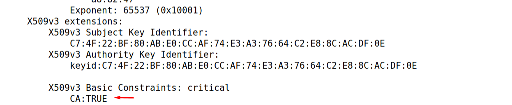


### 2. What part of the certificate indicates this is a self-signed certificate?

The certificate is self-signed because the issuer and the subject are the same and the subject and the authority key are the same:

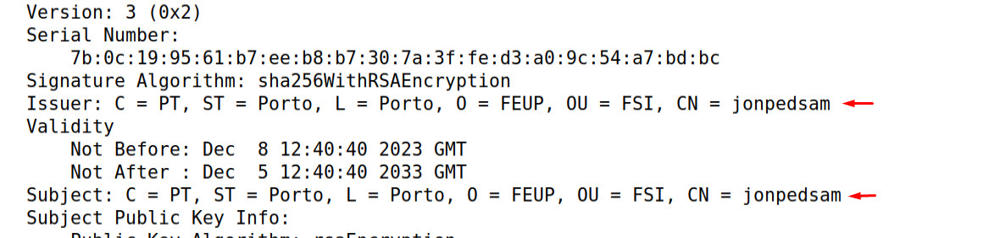

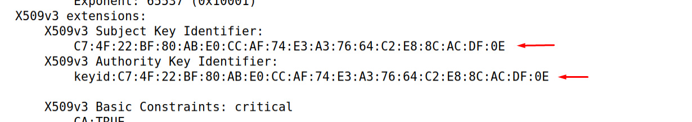


### 3. In the RSA algorithm, we have a public exponent e, a private exponent d, a modulus n, and two secret numbers p and q, such that n = pq. Please identify the values for these elements in your certificate and key files

These values are in the output of ```openssl rsa -in ca.key -text -noout``` above.

## 3.2 Task 2: Generating a Certificate Request for Your Web Server

### Context

A company called jonpedsam.com (our server name) wants to get a publickey certificate from our CA. First it needs to generate a Certificate Signing Request (CSR), which basically includes the company’s public key and identity information. The CSR will be sent to the CA, who will verify the identity information in the request, and then generate a certificate.


### Solutions

To generate a CSR for our server, we used the following command:

```
openssl req -newkey rsa:2048 -sha256 \
-keyout server.key -out server.csr \
-subj "/CN=www.jonpedsam.com/O=Jonpedsam Inc./C=US" \
-passout pass:dees
```

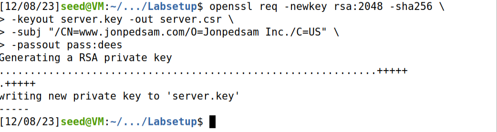

The command will generate a pair of public/private key, and then create a certificate signing request from the public key. We can use the following commands to look at the decoded content of the CSR and private key files:

After executing ```openssl req -in server.csr -text -noout``` we got the following output:

```
Certificate Request:
    Data:
        Version: 1 (0x0)
        Subject: CN = www.jonpedsam.com, O = Jonpedsam Inc., C = US
        Subject Public Key Info:
            Public Key Algorithm: rsaEncryption
                RSA Public-Key: (2048 bit)
                Modulus:
                    00:cc:4f:b5:ea:bc:28:4d:6c:e3:3d:b8:bf:75:5f:
                    29:36:ee:ba:83:f5:fb:84:d9:bb:a4:8f:c7:90:0b:
                    5b:0c:8e:98:71:26:94:ed:19:bf:5f:b1:e4:a7:7a:
                    ed:78:b8:33:e8:a3:82:90:d3:c7:21:98:eb:55:80:
                    d3:ff:2f:97:7d:df:17:a4:3a:c7:01:50:77:ba:81:
                    5e:85:c7:04:c3:59:d3:d9:72:3f:02:99:ad:0b:bc:
                    49:71:7d:2b:0b:74:46:db:41:2d:70:06:4e:02:8d:
                    7c:c9:9c:f8:51:11:4a:e7:d1:9e:4c:b2:00:8e:e4:
                    a3:f1:d6:37:ee:db:5d:b0:21:17:d3:dd:7e:d0:bd:
                    a7:d6:34:7a:cd:1d:d2:7d:69:03:98:2c:42:73:32:
                    e6:05:c7:74:13:bf:88:ae:3c:be:bf:c2:fa:33:e3:
                    50:66:8d:dd:c4:8a:6a:bb:17:15:cc:45:3e:e5:a8:
                    a7:33:1b:ae:a0:7d:e2:dc:8b:61:59:c5:b9:71:4b:
                    ef:97:c1:54:81:65:d9:a4:6c:a2:95:45:05:5a:67:
                    e0:75:6f:60:70:30:34:90:a3:13:50:eb:ed:db:2e:
                    37:c4:58:c9:87:fb:01:38:60:4c:51:fd:55:ff:39:
                    0d:f2:e3:a4:9e:ec:a7:46:2a:fc:c7:fd:a6:5f:d8:
                    a1:8b
                Exponent: 65537 (0x10001)
        Attributes:
            a0:00
    Signature Algorithm: sha256WithRSAEncryption
         50:92:1a:af:0c:3b:f5:45:23:a6:e5:e4:63:7e:21:4d:40:5d:
         67:b1:37:e3:2d:6d:02:ce:ca:8d:3c:66:7f:c0:00:c4:13:93:
         5a:4a:a7:e6:01:9c:54:b1:d8:5d:55:ea:ee:fc:7e:91:1a:19:
         3a:89:f4:fc:46:73:eb:b8:4f:8c:6f:8a:97:1f:f0:40:c3:c0:
         46:14:6c:93:c4:93:28:08:63:bb:3c:bb:72:fe:03:9f:08:6c:
         55:f8:7d:7e:f2:d0:5c:d2:57:94:52:f9:9c:91:04:a1:85:dc:
         ba:d2:4c:e7:34:be:a7:97:35:20:00:24:27:1c:c7:d1:d1:06:
         1c:71:e7:93:50:63:5c:28:bb:e0:de:5d:b5:7a:a3:75:09:43:
         b0:bc:ab:b3:b4:1b:d7:1f:6d:83:72:0d:58:88:a6:50:ea:09:
         df:be:32:41:f2:de:ea:30:99:ca:48:35:97:49:b2:97:d5:09:
         1c:ad:20:a7:da:57:3b:e6:5c:37:96:1e:fd:d2:7b:51:5c:68:
         29:e9:2c:ba:3d:1f:b7:08:46:34:c8:39:d6:73:9a:25:aa:c3:
         e3:d7:96:fa:5e:eb:d7:9c:6d:4c:72:ca:1c:13:78:15:71:1b:
         79:ad:22:8d:23:7e:20:4d:f5:73:bc:96:43:79:58:d5:e5:f9:
         e7:12:ca:53
```

After executing ```openssl rsa -in server.key -text -noout``` we got the following output:

```
Enter pass phrase for server.key:
RSA Private-Key: (2048 bit, 2 primes)
modulus:
    00:cc:4f:b5:ea:bc:28:4d:6c:e3:3d:b8:bf:75:5f:
    29:36:ee:ba:83:f5:fb:84:d9:bb:a4:8f:c7:90:0b:
    5b:0c:8e:98:71:26:94:ed:19:bf:5f:b1:e4:a7:7a:
    ed:78:b8:33:e8:a3:82:90:d3:c7:21:98:eb:55:80:
    d3:ff:2f:97:7d:df:17:a4:3a:c7:01:50:77:ba:81:
    5e:85:c7:04:c3:59:d3:d9:72:3f:02:99:ad:0b:bc:
    49:71:7d:2b:0b:74:46:db:41:2d:70:06:4e:02:8d:
    7c:c9:9c:f8:51:11:4a:e7:d1:9e:4c:b2:00:8e:e4:
    a3:f1:d6:37:ee:db:5d:b0:21:17:d3:dd:7e:d0:bd:
    a7:d6:34:7a:cd:1d:d2:7d:69:03:98:2c:42:73:32:
    e6:05:c7:74:13:bf:88:ae:3c:be:bf:c2:fa:33:e3:
    50:66:8d:dd:c4:8a:6a:bb:17:15:cc:45:3e:e5:a8:
    a7:33:1b:ae:a0:7d:e2:dc:8b:61:59:c5:b9:71:4b:
    ef:97:c1:54:81:65:d9:a4:6c:a2:95:45:05:5a:67:
    e0:75:6f:60:70:30:34:90:a3:13:50:eb:ed:db:2e:
    37:c4:58:c9:87:fb:01:38:60:4c:51:fd:55:ff:39:
    0d:f2:e3:a4:9e:ec:a7:46:2a:fc:c7:fd:a6:5f:d8:
    a1:8b
publicExponent: 65537 (0x10001)
privateExponent:
    72:12:83:40:87:43:7d:4f:31:65:31:b4:7c:24:e0:
    8f:12:25:43:2e:60:fb:20:d2:3a:a4:28:49:0d:7e:
    0d:79:c4:35:50:d4:4f:b9:53:77:6b:8c:7d:d2:0d:
    aa:9c:36:27:4a:bb:c8:7e:e5:ac:a5:83:a7:9e:a1:
    3e:d6:64:9f:db:a2:88:88:64:ba:20:22:69:18:78:
    1c:fb:2c:76:a1:bd:bd:a7:a2:f4:a1:b6:d3:59:92:
    2b:f2:35:c9:54:67:87:5d:51:b0:3d:64:ea:d9:f2:
    75:62:d5:e5:f5:60:bc:23:f6:5d:5d:f9:1f:cf:1a:
    96:19:03:eb:b1:c1:12:67:b7:15:e9:72:f4:d2:b6:
    00:bd:45:cd:5e:df:61:69:0a:79:b8:85:d6:ae:c5:
    c4:28:c6:00:f8:2a:22:59:ed:a8:77:c7:e9:3b:1a:
    b9:37:bd:b7:08:f3:81:20:32:29:55:1f:9a:24:90:
    4e:c0:52:a7:12:d6:c5:bb:b0:c9:0e:d8:6d:59:4c:
    5a:7a:31:a5:26:f6:46:9d:89:c0:23:a2:d9:2c:c1:
    67:79:db:25:e0:ad:e8:c9:3d:af:76:5e:a3:c0:9e:
    30:a2:10:e4:9e:a8:f6:ca:4c:8e:3f:33:92:0d:63:
    63:2b:03:07:11:9a:67:d2:ab:28:a7:49:5c:08:ea:
    b1
prime1:
    00:fc:5e:8c:80:63:e4:12:11:75:17:3b:eb:78:83:
    23:d8:60:fd:f7:0c:d5:4e:1f:15:1d:cf:2a:dc:86:
    ba:49:38:e1:39:72:8d:a9:2e:68:60:20:64:83:76:
    6f:b0:4e:4d:c2:e3:81:6b:b3:a1:c2:0c:eb:5e:90:
    83:17:97:c1:3c:4b:4d:06:56:9e:60:aa:de:8f:83:
    cb:cc:2d:40:74:36:34:36:d5:5d:65:40:10:29:f5:
    a3:df:f0:e7:07:80:d0:9b:15:42:89:cd:6a:0c:aa:
    68:f7:6f:bf:b9:7f:5b:a2:da:2b:95:f5:90:09:38:
    52:78:e8:ac:a6:ec:99:b1:53
prime2:
    00:cf:40:2b:48:f2:89:66:f4:15:15:10:8f:0d:b9:
    33:ba:5a:86:a3:ab:91:7b:40:80:f8:63:0e:25:d2:
    96:af:69:3f:e7:e9:c5:d8:71:56:6c:4e:59:2b:0d:
    ea:d3:09:25:f4:39:24:85:8e:e0:ab:16:b6:b5:a1:
    6e:b3:e2:c6:ce:75:21:df:9f:46:3a:0c:cd:1a:2a:
    01:2a:99:fd:48:b0:83:b5:af:69:44:e5:39:75:d7:
    3f:61:8b:a2:27:69:0a:c1:7b:84:06:04:d3:de:d2:
    2f:4e:63:2d:26:81:7e:ce:0e:01:41:fa:81:c7:37:
    92:27:66:8b:3d:d8:f8:2f:e9
exponent1:
    00:cf:ae:4f:19:69:1a:ca:f3:aa:d4:0f:ef:5b:21:
    30:62:64:8f:1a:bb:68:dd:fd:1e:37:85:c0:d3:f1:
    db:63:5e:77:99:fa:f7:30:fe:8b:ce:6f:59:c8:05:
    b3:2b:f7:84:6e:99:22:6c:2b:4b:36:91:c3:2f:f2:
    e4:ae:89:a7:ef:a2:58:24:9b:2b:82:89:9a:d5:a7:
    b4:12:b6:3a:90:67:fa:d8:15:05:e2:c8:b1:84:96:
    2c:e1:a1:31:be:2e:f7:7c:68:26:75:98:a1:69:02:
    e3:96:9c:53:be:a7:5c:15:cc:4c:89:ff:a7:24:af:
    40:cf:57:4a:9d:a3:9f:67:19
exponent2:
    00:c0:06:f1:d4:36:3d:4f:72:2a:b2:88:d4:33:5f:
    fd:68:d6:85:d7:d2:99:0a:7d:3a:c2:6a:6d:6a:68:
    14:0c:55:55:cc:18:d3:a2:f7:68:9f:13:7d:15:22:
    61:08:c6:7a:2f:2e:5f:03:8c:dd:e8:48:34:64:58:
    3e:4d:58:7a:e2:42:af:6f:16:91:a8:29:c2:44:52:
    d5:1f:d6:ec:52:d4:92:44:de:51:88:6f:67:6d:23:
    52:6b:9c:48:53:81:c5:60:7e:84:56:5b:54:c0:29:
    39:81:c4:ec:c9:b7:c4:79:41:8a:b2:ca:5c:42:ec:
    df:73:b8:54:9d:aa:92:53:39
coefficient:
    4d:9c:5d:bc:01:0e:aa:fa:33:8c:13:77:85:d6:cc:
    bc:6a:01:c4:38:a0:44:e5:7e:82:ec:f5:96:06:98:
    e6:fc:9f:17:2f:54:dd:4a:40:e8:b7:bc:39:2c:3b:
    77:95:33:1f:69:93:09:19:dc:45:23:14:18:51:7e:
    34:8d:98:c7:bd:85:7a:73:5e:09:6c:97:90:73:0e:
    a0:d4:c1:d8:ae:6f:42:13:b6:2a:75:4b:73:43:b9:
    ce:01:1a:08:64:1f:d6:bc:26:ce:de:82:0b:13:f5:
    af:9a:2d:d7:b9:31:41:83:ee:b4:87:14:6e:4f:51:
    e8:f9:78:d7:aa:99:6d:39
```

### Note
Many websites have different URLs all pointing to the same web server. To allow a certificate to have multiple names we will use the following command:


```
-addext "subjectAltName = DNS:www.jonpedsam.com, \
DNS:www.jonpedsamC.com, \
DNS:www.jonpedsamD.com"
```

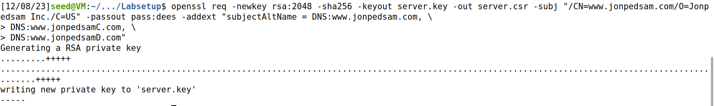

## 3.3 Task 3: Generating a Certificate for your server

### Context

The CSR file needs to have the CA’s signature to form a certificate. In the real world, the CSR files are usually sent to a trusted CA for their signature. In this lab, we will use our own trusted CA to generate certificates. The following command turns the certificate signing request (server.csr) into an X509 certificate (server.crt), using the CA’s ca.crt and ca.key:

```
openssl ca -config myCA_openssl.cnf -policy policy_anything \
-md sha256 -days 3650 \
-in server.csr -out server.crt -batch \
-cert ca.crt -keyfile ca.key
```

### Solutions

For the task 3, we will use the previous command by changing "myCA_openssl.cnf" to  "openssl.cnf" from the first task.

Executing the command, we get the following output:
```
openssl ca -config openssl.cnf -policy policy_anything \
-md sha256 -days 3650 \
-in server.csr -out server.crt -batch \
-cert ca.crt -keyfile ca.key
```

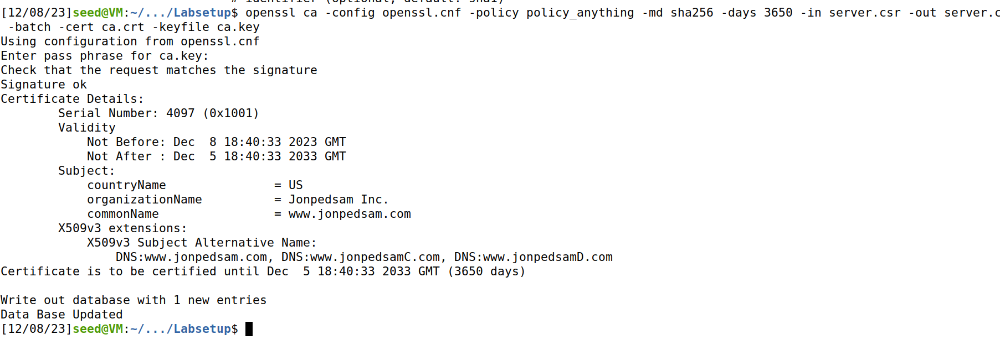


After uncommenting the line "copy_extensions = copy" from openssl.cnf and running ```openssl x509 -in server.crt -text -noout``` we got the following output:

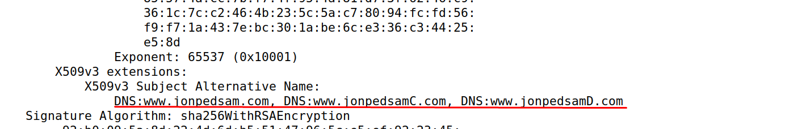

The output confirms that the certificate has all the names added in the previous task.


## 3.4 Task 4: Deploying Certificate in an Apache-Based HTTPS Website

### Context
In this task, we will see how public-key certificates are used by websites to secure web browsing. We will set up an HTTPS website based Apache. The Apache server, which is already installed in our container, supports the HTTPS protocol. To create an HTTPS website, we just need to configure the Apache server, so it knows where to get the private key and certificates.

Since we forgot to update the lines in the "/etc/hosts", we did in this task by executing ```sudo gnome-text-editor /etc/hosts``` and we added the necessay lines.


Following the steps in the seedlabs, we created an auxiliar folder with everything that we need for this task: Dockerfile, jonpedsam_apache_ssl.conf, index.html and index_red.html files and the server.crt and server.key files.

We changed our Dockerfile to this:

```
FROM handsonsecurity/seed-server:apache-php

ARG WWWDIR=/var/www/jonpedsam

COPY ./index.html ./index_red.html $WWWDIR/
COPY ./jonpedsam_apache_ssl.conf /etc/apache2/sites-available
COPY ./certs/server.crt ./certs/server.key /certs/

RUN chmod 400 /certs/server.key \
    && chmod 644 $WWWDIR/index.html \
    && chmod 644 $WWWDIR/index_red.html \
    && a2ensite jonpedsam_apache_ssl

CMD tail -f /dev/null
```

After, we changed our jonpedsam_apache_ssl.conf for this:

```
<VirtualHost *:443>
    DocumentRoot /var/www/jonpedsam
    ServerName     www.jonpedsam.com
    ServerAlias    www.jonpedsamC.com
    ServerAlias    www.jonpedsamD.com
    DirectoryIndex index.html
    SSLEngine On
    SSLCertificateFile /certs/server.crt
    SSLCertificateKeyFile /certs/server.key
</VirtualHost>

<VirtualHost *:80>
    DocumentRoot /var/www/jonpedsam
    ServerName www.jonpedsam.com
    DirectoryIndex index_red.html
</VirtualHost>
```

Since we are using our custom files, we needed to change the docker-compose to execute this directory, by changing build to : ./task4_aux.

Then, we executed dcbuild and dcup to execute the apache command and start the server:

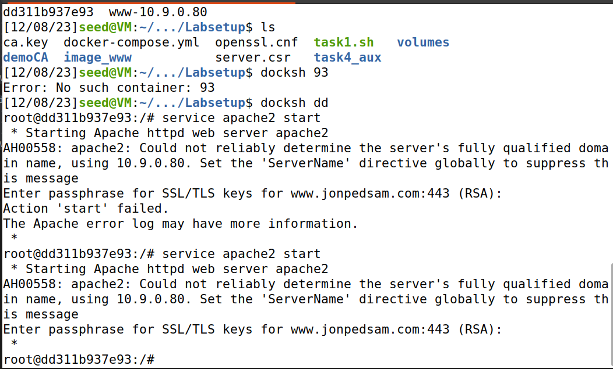


After, we tried to access our server in the browser and we got a warning:

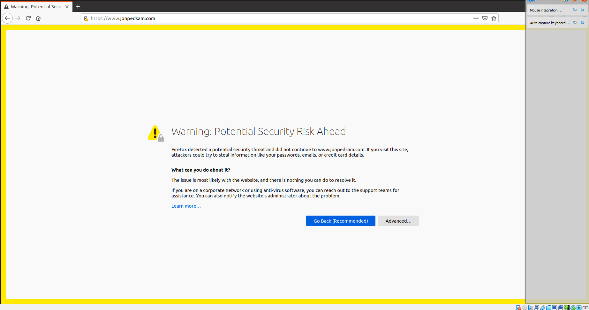

To solve this, we imported our CA that we used in this lab to the trusted browser authorities:

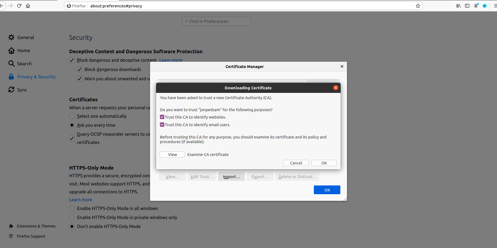

After, as expected, we access our server with success.

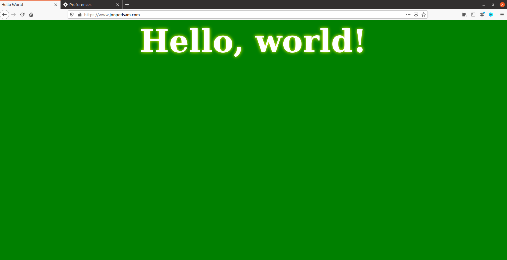


## 3.5 Task 5: Launching a Man-In-The-Middle Attack

### Context

Assume Alice wants to visit example.com via the HTTPS protocol. She needs to get the public key from the example.com server; Alice will generate a secret, and encrypt the secret using the server’s public key, and send it to the server. If an attacker can intercept the communication between Alice and the server, the attacker can replace the server’s public key with its own public key. Therefore, Alice’s secret is actually encrypted with the attacker’s public key, so the attacker will be able to read the secret. The attacker can forward the secret to the server using the server’s public key. The secret is used to encrypt the communication between Alice and server, so the attacker can decrypt the encrypted communication.

### Step 1: Setting up the malicious website

For this step, we changed the jonpedsam_apache_ssl.conf to include our target website (facebook):

```
<VirtualHost *:443>
    DocumentRoot /var/www/jonpedsam
    ServerName     www.facebook.com
    ServerAlias    www.jonpedsam.com
    ServerAlias    www.jonpedsamC.com
    ServerAlias    www.jonpedsamD.com
    DirectoryIndex index.html
    SSLEngine On
    SSLCertificateFile /certs/server.crt
    SSLCertificateKeyFile /certs/server.key
</VirtualHost>

<VirtualHost *:80>
    DocumentRoot /var/www/jonpedsam
    ServerName www.facebook.com
    DirectoryIndex index_red.html
</VirtualHost>
```

### Step 2: Becoming the man in the middle

In this step, we are performing a man in the middle attack, "we simply modify the victim’s machine’s /etc/hosts file to emulate the result of a DNS cache positing attack by mapping the hostname www.example.com to our malicious web server" (from lab instructions).

10.9.0.80 www.instagram.com


### Step 3: Browse the target website

When we tried to access www.facebook.com, we got the following warning:

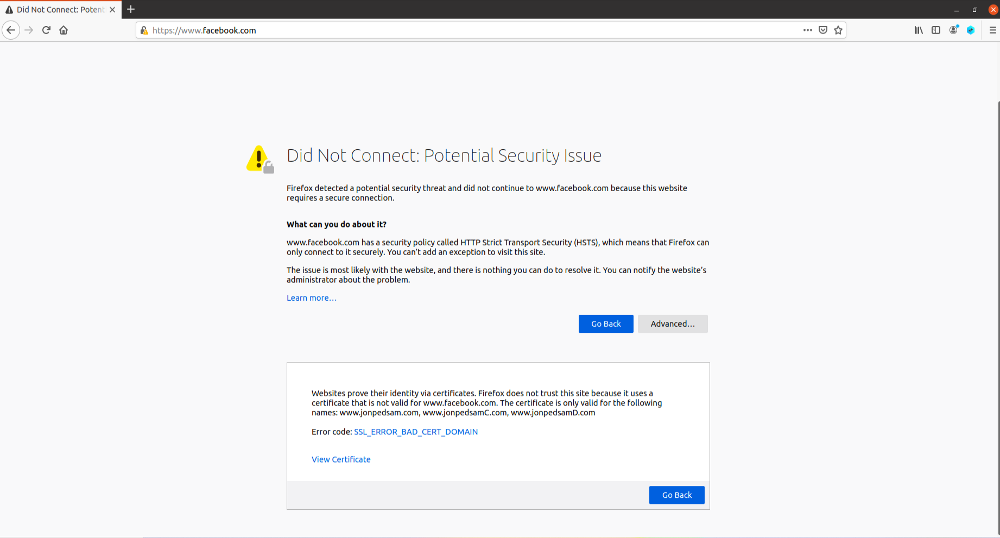

This is attributed to the inconsistency of the certificate used because the domain name does not match that present in the server's certificate.

This type of websites detect this and warn the user.
