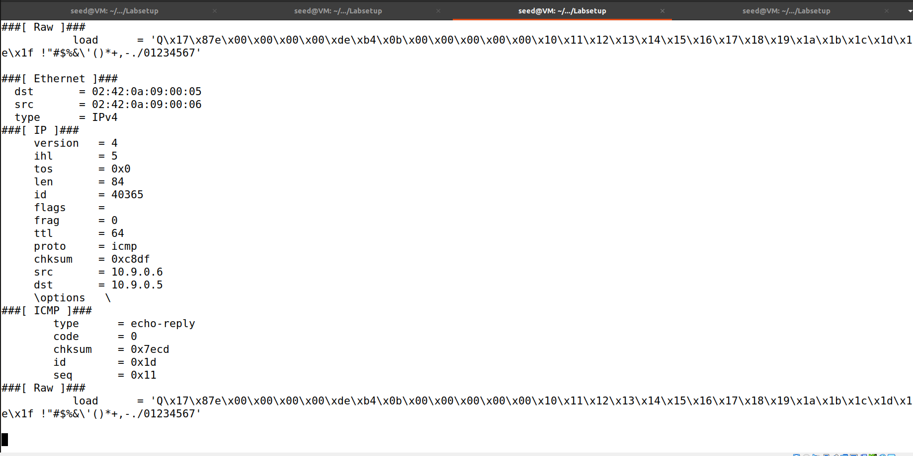

# Packet Sniffing and Spoofing Lab

# Lab Task Set 1: Using Scapy to Sniff and Spoof Packets

## Context
"Many tools can be used to do sniffing and spoofing, but most of them only provide fixed functionalities. Scapy is different: it can be used not only as a tool, but also as a building block to construct other sniffing and spoofing tools, i.e., we can integrate the Scapy functionalities into our own program. In this set of tasks, we will use Scapy for each task."

# Task 1.1: Sniffing Packets

## Context

The objective of this task is to learn how to use Scapy to do packet sniffing in Python programs.

Using the following python code, we will sniff the packets on the br-c93733e9f913 interface.:
```
#!/usr/bin/env python3
from scapy.all import *
def print_pkt(pkt):
pkt.show()
pkt = sniff(iface=’br-c93733e9f913’, filter=’icmp’, prn=print_pkt)
```

"We need to find the name of the corresponding network interface on our VM, because we need to use it in our programs. The interface name is the concatenation of br- and the ID of the network created by Docker. When we use ifconfig to list network interfaces, we will see quite a few. Look for the IP address 10.9.0.1."


## Task 1.1A Solution

By running this python script on the attacker with root:

```python
#!/usr/bin/env python3
from scapy.all import *
def print_pkt(pkt):
    pkt.show()
pkt = sniff(iface='br-cf370a106790', filter='icmp', prn=print_pkt)
```


And then using ping on hostA to hostB:


We can see that our attack was successful because the packets were intercepted:



When running without root, we got the following error:


## Task 1.1B

"Usually, when we sniff packets, we are only interested certain types of packets. We can do that by setting filters in sniffing. Scapy’s filter use the BPF (Berkeley Packet Filter) syntax."

• To capture only the ICMP packet, we use the following code (The same used in the Task 1.1 A):

```python
#!/usr/bin/env python3
from scapy.all import *
def print_pkt(pkt):
    pkt.show()
pkt = sniff(iface='br-cf370a106790', filter='icmp', prn=print_pkt)
```

• To capture any TCP packet that comes from a particular IP and with a destination port number 23.

```python
#!/usr/bin/env python3
from scapy.all import *
def print_pkt(pkt):
    pkt.show()
pkt = sniff(iface='br-cf370a106790', filter='tcp and src host <source_ip> and dst port 23', prn=print_pkt)
```

• To capture packets comes from or to go to a particular subnet. You can pick any subnet, such as 128.230.0.0/16; you should not pick the subnet that your VM is attached to.

```python
#!/usr/bin/env python3
from scapy.all import *
def print_pkt(pkt):
    pkt.show()
pkt = sniff(iface='br-cf370a106790', filter='net 128.230.0.0/16', prn=print_pkt)
```

# Task 1.2: Spoofing ICMP Packets

## Context 
"As a packet spoofing tool, Scapy allows us to set the fields of IP packets to arbitrary values. The objective of this task is to spoof IP packets with an arbitrary source IP address."

The following code shows an example of how to spoof an ICMP packets:

```
>>> from scapy.all import *
>>> a = IP() ➀
>>> a.dst = ’10.0.2.3’ ➁
>>> b = ICMP() ➂
>>> p = a/b ➃
>>> send(p) ➄
.
Sent 1 packets.
```

" Line ➂ creates an ICMP object. The default type is echo request. In Line ➃, we stack a and b together to form a new object. The / operator is overloaded by the IP class, so it no longer represents division; instead, it means adding b as the payload field of a and modifying the fields of a accordingly. As a result, we get a new object that represent an ICMP packet. We can now send out this packet using send() in Line ➄. "


## Solution

For this task, using the previous information, we created the following python "spoofer.py" code:

```python
#!/usr/bin/env python3
from scapy.all import *

a = IP()
a.dst = '10.9.0.6'
b = ICMP()
p = a/b 
send(p)
```

By using the previous code, we are sending an ICMP packet to the container that we specified, in this case, ip '10.9.0.6' the hostB.

When executing this code as root, we got the following output:


Then, using WireShark program, we can verify that the packet was sent and received by the hostB with ip '10.9.0.6':


# Task 1.3: Traceroute

## Context

"The objective of this task is to use Scapy to estimate the distance, in terms of number of routers, between your VM and a selected destination. This is basically what is implemented by the traceroute tool. In this task, we will write our own tool. The idea is quite straightforward: just send an packet (any type) to the destination, with its Time-To-Live (TTL) field set to 1 first. This packet will be dropped by the first router, which will send us an ICMP error message, telling us that the time-to-live has exceeded. That is how we get the IP address of the first router. We then increase our TTL field to 2, send out another packet, and get the IP address of the second router. We will repeat this procedure until our packet finally reach the destination."

"It should be noted that this experiment only gets an estimated result, because in theory, not all these packets take the same route (but in practice, they may within a short period of time). The code in the following shows one round in the procedure."

For that, we used the following python script: to find the distance from our VM and '8.8.8.8':
```python
#!/usr/bin/env python3
from scapy.all import *

for i in range(1, 50):
    p = IP(dst='8.8.8.8', ttl=i) / ICMP()
    p.show()
    send(p)
```

We can conclude that we needed 21 routers (TTL=21) until it got to the destination.


# Task 1.4

For this task the objective was to implement a sniff-and-then-spoof program using Scapy. The program was designed to run on a virtual machine (VM) monitoring a local area network (LAN).

## Setup:
- Two machines on the same LAN: VM (for running the sniff-and-spoof program) and the user container.
- Utilized Scapy for packet sniffing and spoofing.

## Procedure:
1. Pinging three different IP addresses from the user container:
    - ping 1.2.3.4 ->  non-existing host on the Internet.
    - ping 10.9.0.99 ->  A non-existing host on the LAN.
    - ping 8.8.8.8  ->  An existing host on the Internet.

2. Sniff-and-Spoof Program Operation:
    - The program on the VM monitored the LAN for ICMP echo requests.
    - Upon detecting any ICMP echo request, regardless of the target IP address, the program immediately sent out an echo reply using packet spoofing.

## Results:

### 1. Pinging 1.2.3.4 (Non-existing host on the Internet):
   - **Explanation:**
        - The spoofing program responded to ICMP echo requests for any target IP address, including non-existing hosts.
        - ARP protocol was likely involved. When the user container sent a ping to a non-existing host, it broadcasted an ARP request on the LAN. The VM's sniff-and-spoof program intercepted this request and responded with a spoofed echo reply.

### 2. Pinging 10.9.0.99 (Non-existing host on the LAN):
   - **Explanation:**
        - The program responded to all ICMP echo requests, regardless of the target's existence on the LAN.
        - ARP requests triggered by the ping to a non-existing LAN host were intercepted and spoofed by the program.

### 3. Pinging 8.8.8.8 (Existing host on the Internet):
   - **Explanation:**
        - The program's response to ICMP echo requests did not depend on the actual existence of the target host.
        - The ARP protocol and routing information were likely utilized to correctly handle the requests and provide consistent responses.

## Conclusion:
The experiment demonstrated that the sniff-and-then-spoof program successfully manipulated the ICMP echo requests on the LAN, consistently generating spoofed echo replies regardless of the target's actual existence. This highlights the vulnerability of relying solely on ICMP echo replies for network availability assessment and emphasizes the importance of securing against such spoofing attacks.

