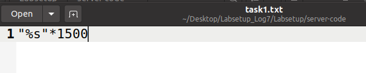
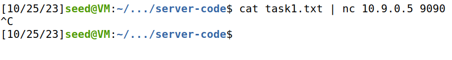

# Format String Attack Lab

## Environment Setup

To begin our assignment, we need to turn off the address randomization using the following command

```bash
 $ sudo sysctl -w kernel.randomize_va_space=0
 ```

Before opening the terminals, it is important that we compile the program using the *"-z execstack"* option, which allows the stack to be executable.

Then, we open two terminals, one with the servers, using Docker from Seed-Labs, and another one to communicate with the servers. This allows us to see the exchange of messages between both sides. For example, when we send a string to the server using the command:

```bash
 $ echo 'hello' | nc 10.9.0.5 9090
 ```

We can see the following content appear on the other side:


From this, we can see some important addresses that we will be using in the following tasks, such as:

The Buffer Input Address;
The Secret Message Address;
The Frame Pointer;
The Target Variable's initial and final values.


Depois abrimos dois terminais, um com os servidores usando o Docker dos seed-labs e outro (o cliente) para comunicar com os servidores. Isto permitiu ver as mensagens trocadas dos dois lados. Ao mandar uma string para o servidor, usando o comando:

# Task 1

To crash our program, firstly we created a file called task1.txt with the following content:



Then, when we execute the code, our program will read values from the stack that are not valid memory addresses. The message *Returned Properly* did not appear, so we know that our program crashed, as expected.




